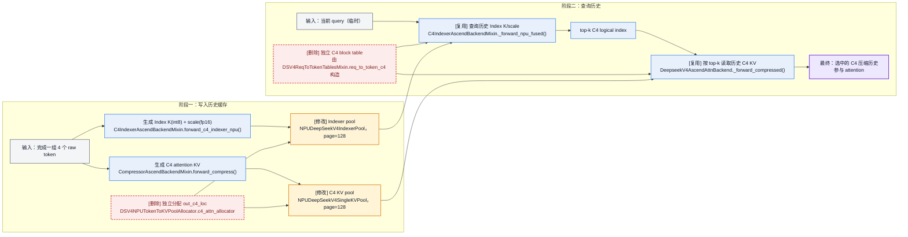
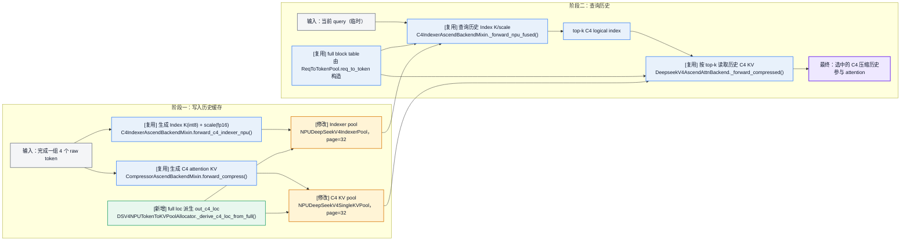
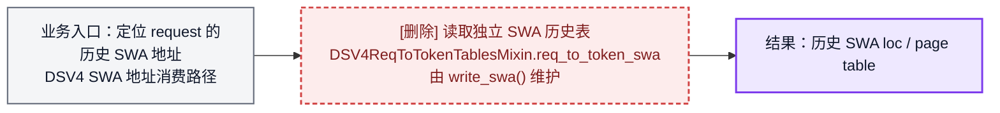

# NPU DSV4 Cache 地址空间重构方案

## 1. 方案总结

本次重构包含两项改动：

1. **复用 full 地址映射**：C4 和 Indexer 的 page size 从 128 改为 32，共同复用 full page id 和 block table；SWA 复用现有 `full_to_swa_index_mapping`。删除 C4 独立 allocator、`req_to_token_c4` 和 `req_to_token_swa`。
2. **NPU fused compressor 支持 ring**，C4/C128 及 Indexer 的 compressor state 改为固定 ring buffer，不再需要 state allocator 和两张 state request table。

> 当前代码索引：[六类 allocator](dsv4_allocator.py#L122-L188) · [五张辅助 request table](dsv4_req_to_token_pool.py#L43-L101) · [GPU C4 native page 布局](../../../mem_cache/deepseek_v4_memory_pool.py#L562-L645) · [GPU C4 地址派生](../../../../kernels/ops/attention/dsv4/metadata_kernel.py#L34-L50)


## 2. 改动一：复用 full 地址映射

### 2.1 C4 复用 full 地址空间

full page 包含 128 个 raw token，C4 每 4 个 raw token 生成一个压缩 token，因此一个 full page 刚好对应一个 32-token C4 page。

目标修改：

- C4 attention KV pool 的 physical page size 改为 32。
- C4 page id 直接使用 full page id，C4 attention 复用 full block table。
- C4 写入地址由 full loc 直接派生。
- 删除 C4 allocator、`req_to_token_c4` 和独立 C4 page-table 构造逻辑。
- C4 KV buffer 仍然保留，变化的是它的寻址和生命周期管理方式。

这项修改依赖 `npu_sparse_attn_sharedkv` 能同时使用 ori page 128 和 C4 page 32。

代码框架对比：

这条链路有两路输入和两个最终结果：

- **写地址输入**：[`DSV4NPUTokenToKVPoolAllocator.alloc_extend()` / `alloc_decode()`](dsv4_allocator.py#L573-L670) 调用父类完成 full 分配，得到本轮 `out_full_loc`；重构后统一在 `_wrap_full_alloc()` 接入 C4 地址派生。
- **读地址输入**：[`ReqToTokenPool.req_to_token`](../../../mem_cache/memory_pool.py#L250-L314) 已保存 full KV 的历史地址，由 attention backend 读取。它不是 `_wrap_full_alloc()` 的返回值。
- **结果一（写地址）**：得到 `out_c4_loc`，告诉 compressor 本轮新生成的 C4 KV 写到哪里。
- **结果二（读地址）**：得到 C4 page table，告诉 SparseAttn 到哪些 page 读取历史 C4 KV。

颜色说明：蓝色表示复用，绿色表示新增，橙色表示修改，红色表示删除；灰色是业务处理，紫色是最终结果。

重构前，两个结果都依赖 C4 独立地址管理：

```mermaid
flowchart LR
    Entry["分配入口<br/>DSV4NPUTokenToKVPoolAllocator.alloc_extend() / alloc_decode()"]:::neutral
    FullAlloc["父类完成 full 分配<br/>SWATokenToKVPoolAllocator.alloc_extend() / alloc_decode()"]:::reused
    OldJoin["进入 DSV4 C4 分配<br/>DSV4NPUTokenToKVPoolAllocator._alloc_c_and_state()"]:::changed
    Count["计算本轮完成的 4-token 分组数<br/>DSV4NPUTokenToKVPoolAllocator._compute_c_extend_counts()"]:::reused
    History["查询历史 C4 尾地址<br/>DSV4ReqToTokenTablesMixin.req_to_token_c4<br/>用于从当前 C4 page/offset 继续分配"]:::deleted
    Alloc["独立分配 C4 slot<br/>DSV4NPUTokenToKVPoolAllocator.c4_attn_allocator"]:::deleted
    WriteLoc["结果一：out_c4_loc<br/>DSV4OutCacheLoc.out_c4_loc"]:::reused
    Compressor["compressor 生成并写入本轮 C4 KV"]:::neutral
    Pool["C4 KV pool<br/>NPUDeepSeekV4SingleKVPool，page=128"]:::changed
    WriteTable["记录新地址<br/>DSV4ReqToTokenTablesMixin.write_c4()"]:::deleted
    Table["维护历史地址<br/>req_to_token_c4"]:::deleted
    BuildTable["结果二：构造独立 C4 page table<br/>CompressorAscendBackendMixin._compute_compress_locs()"]:::deleted
    Attention["最终：SparseAttn 能读取完整 C4 历史"]:::result

    Entry --> FullAlloc --> OldJoin --> Count --> Alloc --> WriteLoc
    History --> Alloc
    WriteLoc --> Compressor --> Pool --> Attention
    WriteLoc --> WriteTable --> Table --> BuildTable --> Attention

    classDef reused fill:#E8F1FB,stroke:#3B82F6,color:#0F172A,stroke-width:1.5px;
    classDef changed fill:#FFF4D6,stroke:#D97706,color:#0F172A,stroke-width:1.5px;
    classDef deleted fill:#FDECEC,stroke:#D14343,color:#7F1D1D,stroke-width:2px,stroke-dasharray:5 3;
    classDef neutral fill:#F4F5F7,stroke:#6B7280,color:#0F172A,stroke-width:1.5px;
    classDef result fill:#EEE8FF,stroke:#7C3AED,color:#0F172A,stroke-width:2px;
```



`alloc_extend()` 用于 prefill/chunk 一次新增多个 raw token，`alloc_decode()` 用于 decode 时每个 request 新增一个 raw token。它们只负责预留地址，不负责计算或写入 KV；一次调用会先通过父类分配 full/SWA，再通过 `_alloc_c_and_state()` 分配 C4、C128 和 compressor state，最后返回一个 `DSV4OutCacheLoc` 地址集合。

以一个 request 从 raw 长度 6 扩展到 10 为例：

1. 父类 full allocator 根据 full 尾地址分配 4 个 raw slot。假设当前 full page id 是 5，则 `out_full_loc=[646, 647, 648, 649]`。
2. C4 长度从 `6//4=1` 增长到 `10//4=2`，说明本轮只新生成 1 个 C4 KV（raw position 7 完成了 4～7 这一组）。
3. C4 使用独立地址空间。假设 `req_to_token_c4[req, 0]=256`，表示上一个 C4 KV 位于 C4 page 2、offset 0。
4. `_alloc_c_extend()` 将 256 作为 C4 尾地址交给 `c4_attn_allocator`，allocator 从同一 C4 page 继续分配，得到 `out_c4_loc=[257]`。
5. compressor 将本轮 C4 KV 写到 slot 257，`write_c4()` 再把 257 写入 `req_to_token_c4[req, 1]`。attention backend 后续通过这张表构造 C4 page table。

这里的两个地址对象作用不同：

| 地址对象 | 生命周期 | 作用 |
| --- | --- | --- |
| `out_c4_loc` | 仅本次 forward | 按 batch 顺序保存“本轮新增 C4 KV”的物理写入 slot，供 compressor 写入 |
| `req_to_token_c4` | 整个 request | 保存“request 的第几个 C4 KV→物理 slot”的完整历史映射，供后续分配和 attention 查询 |

因此，得到 `out_c4_loc=[257]` 后还必须记录新地址：一方面，下次再完成一个 C4 分组时，需要从 `req_to_token_c4[req, 1]=257` 找到尾地址并继续分配；另一方面，SparseAttn 需要根据完整的 `[256, 257, ...]` 历史地址构造 C4 page table。仅保留本轮的 `out_c4_loc` 无法完成这两件事。

查询 C4 尾地址的目的，就是找到独立 C4 地址空间中“上一次写到哪里”。paged allocator 需要它判断下一个 slot 应继续使用当前 page，还是申请新 page。由于当前 C4 与 full 地址无关，这个尾地址不能从 full 尾地址推导，只能查询 `req_to_token_c4`。

重构后，写地址从 full loc 派生，读地址直接复用 full block table：

```mermaid
flowchart LR
    Entry["分配入口<br/>DSV4NPUTokenToKVPoolAllocator.alloc_extend() / alloc_decode()"]:::neutral
    FullAlloc["复用父类 full 分配<br/>SWATokenToKVPoolAllocator.alloc_extend() / alloc_decode()"]:::reused
    Start["写地址链路起点：接收 out_full_loc<br/>DSV4NPUTokenToKVPoolAllocator._wrap_full_alloc()"]:::changed
    Derive["派生本轮 C4 写地址<br/>DSV4NPUTokenToKVPoolAllocator._derive_c4_loc_from_full()<br/>① 筛选完成 4-token 分组的 full loc　② full loc // 4"]:::added
    WriteLoc["结果一：out_c4_loc<br/>DSV4OutCacheLoc.out_c4_loc"]:::reused
    Compressor["compressor 生成并写入本轮 C4 KV"]:::neutral
    Pool["C4 KV pool<br/>NPUDeepSeekV4SingleKVPool，page=32"]:::changed
    BaseTable["复用完整历史地址<br/>ReqToTokenPool.req_to_token"]:::reused
    ReadTable["结果二：full block table 直接作为 C4 page table<br/>CompressorAscendBackendMixin._compute_compress_locs()"]:::changed
    Attention["最终：SparseAttn 能读取完整 C4 历史"]:::result

    Entry --> FullAlloc --> Start --> Derive --> WriteLoc
    BaseTable --> ReadTable
    WriteLoc --> Compressor --> Pool --> Attention
    ReadTable --> Attention

    classDef reused fill:#E8F1FB,stroke:#3B82F6,color:#0F172A,stroke-width:1.5px;
    classDef added fill:#E8F7EE,stroke:#22A06B,color:#0F172A,stroke-width:1.5px;
    classDef changed fill:#FFF4D6,stroke:#D97706,color:#0F172A,stroke-width:1.5px;
    classDef neutral fill:#F4F5F7,stroke:#6B7280,color:#0F172A,stroke-width:1.5px;
    classDef result fill:#EEE8FF,stroke:#7C3AED,color:#0F172A,stroke-width:2px;
```



`DSV4OutCacheLoc.out_c4_loc` 是一次 forward 内新生成的 C4 KV 的写入位置，不是长期保存地址的 request table。重构前它由 `c4_attn_allocator` 分配；重构后保留这个字段供 compressor 使用，但字段值改由 `_derive_c4_loc_from_full()` 生成。

该转换方法从 `out_full_loc` 中选出“刚好完成一个 4-token 分组”的位置，再执行 `full loc // 4`。例如 full page 7 的 raw offset 3、7 对应 full loc 899、903，转换后得到 C4 loc 224、225，也就是 C4 page 7 的 offset 0、1。这样既保持 full/C4 page id 一致，也不再需要 C4 allocator。

SparseAttn “复用 full”指复用 full block table 中的物理 page id，不是读取 full KV buffer。假设一个 request 有 300 个 raw token，full page size=128，三个逻辑页实际分配到物理 page `[5, 9, 2]`：

| 逻辑范围 | full 物理页 | 对应 C4 范围 | C4 物理页 |
| --- | --- | --- | --- |
| raw 0～127 | 5 | C4 0～31 | 5 |
| raw 128～255 | 9 | C4 32～63 | 9 |
| raw 256～299 | 2 | C4 64～74 | 2 |

因此 full block table `[5, 9, 2]` 可以直接作为 C4 block table。假设 Indexer 选中 C4 logical index 35，SparseAttn 按 C4 page size 32 计算：page-table column=`35//32=1`，physical page=`[5,9,2][1]=9`，offset=`35%32=3`，最终从独立 C4 KV buffer 的 slot `9*32+3=291` 读取。最后一页只有 11 个有效 C4 token，由 C4 sequence length 限制读取范围。

代码处理集中在现有类中：[`_wrap_full_alloc()`](dsv4_allocator.py#L608-L670) 接入 C4 地址派生；[`_alloc_c_extend()` / `_alloc_c_and_state()`](dsv4_allocator.py#L275-L367) 移除 C4 分配分支、仅保留 C128；[`DSV4NPUTokenToKVPool._make_kv_pool()`](dsv4_memory_pool.py#L286-L315) 使用子 pool 的实际 page size；[`_compute_compress_locs()`](../attention/ascend_dsv4_backend.py#L242-L337) 改为复用 full block table。不新增 pool 或 allocator 类。

> 当前代码索引：[C4 独立分配](dsv4_allocator.py#L196-L326) · [C4 request table](dsv4_req_to_token_pool.py#L65-L98) · [C4 page table 构造](../attention/ascend_dsv4_backend.py#L323-L337) · [SparseAttn 的 ori/cmp page 限制](../attention/ascend_dsv4_backend.py#L1695-L1756)

### 2.2 Indexer 保留独立 pool，但与 C4 共享地址

Indexer 是 C4 历史的“搜索目录”：它使用独立的 index key 和 scale 为当前 query 选出 top-k C4 位置，SparseAttn 再只读取这些位置的 C4 KV。

Indexer 与 C4 attention 保留两个独立物理 pool，因为两者保存的数据和格式不同：

| Pool | 作用 | 目标管理方式 |
| --- | --- | --- |
| C4 KV pool | 保存最终参与 attention 的压缩 KV | 独立 buffer，page=32，复用 full page id |
| C4 Indexer pool | 保存用于 top-k 检索的 index K/scale | 独立 buffer，page=32，复用同一 full page id |

两个 pool 使用同一个 C4 loc 和 block table，所以 Indexer **不需要独立 allocator，也不需要独立 request table**。

`npu_quant_lightning_indexer` 已确认支持 page size 32：PA_BSND 布局的 block size 支持 16 的整数倍。因此 Indexer 可与 C4 一起切换到 full 映射模型。

代码框架对比：

Indexer pool 保存的是每个历史 C4 token 的搜索特征：量化后的 Index K（int8）和对应 scale（fp16）。它不保存 query，也不保存 attention 使用的 C4 KV。当前 query 是查询阶段的临时输入，用来和历史 Index K/scale 打分。

需要区分“生成 Index K”和“查询 Index K”：生成新的 Index K/scale 时只使用本轮 token 数据，并通过 `out_c4_loc` 写入 Indexer pool，不需要 block table；只有后续 query 查询历史 Index K/scale 时，才使用 block table 定位 Indexer pool 中的历史条目。

这条链路分为两个阶段，有两路输入和一个最终结果：

- **写入阶段输入**：每完成一组 4 个 raw token，生成一份 C4 attention KV 和一份 Index K/scale，并用同一个 `out_c4_loc` 写入两个独立 pool。
- **查询阶段输入**：当前 query 和历史 C4 block table。query 不写入 Indexer pool，只用于检索历史 Index K/scale。
- **最终结果**：Indexer 返回 top-k C4 logical index，SparseAttn 据此读取对应的历史 C4 KV。

颜色说明：蓝色表示复用，绿色表示新增，橙色表示修改，红色表示删除；灰色是业务输入，紫色是最终结果。

重构前，两个阶段都使用 C4 独立地址体系：



重构后，两个阶段继续共享 C4 地址，但地址来源改为 2.1 的 full 映射：



查询历史时复用 full 的具体方式是：backend 将 full block table 作为 `npu_quant_lightning_indexer` 的 `block_table` 参数，但算子读取的是独立 Indexer pool。假设 request 有 300 个 raw token，full block table=`[5,9,2]`，则共有 `300//4=75` 个历史 C4 Index 条目。查询 C4 logical index 35 时，算子计算 logical page=`35//32=1`、offset=`35%32=3`，从 full block table 得到 physical page id 9，最终读取 Indexer pool 的 slot `9*32+3=291` 中的 Index K/scale。所有有效历史条目完成打分后，算子返回 top-k logical index；SparseAttn 再用同一 block table 到 C4 KV pool 读取这些 index 对应的 C4 KV。整个过程不读取 full KV buffer，复用的只是 full block table 中的 physical page id。

有效 Index 数量不由 block table 长度决定，因为 block table 可能包含 padding；它只负责 logical page→physical page 映射。每个 request 的有效 C4 Index 数量由实际序列长度计算：`num_c4=seq_len//4`。NPU fused 路径向 `npu_quant_lightning_indexer` 传入 `actual_seq_lengths_key` 和 `cmp_ratio=4`，算子据此限制打分范围；fallback 路径也直接使用 `seq_i//ratio`。prefill 中每个 query 还会叠加 causal 边界，只能看到该 query 位置之前已经完成的 C4 分组。

只修改 [`_make_indexer_pool()`](dsv4_memory_pool.py#L369-L393) 的 kernel page size，并在初始化时校验它与 C4 page size 一致；[`NPUDeepSeekV4IndexerPool`](dsv4_memory_pool.py#L195-L270) 及其读写方法、[`forward_c4_indexer_npu()`](../attention/ascend_dsv4_backend.py#L841-L950) 均复用。不删除 Indexer pool，也不新增 allocator、request table 或转换方法。

> 当前代码索引：[NPU Indexer pool](dsv4_memory_pool.py#L195-L272) · [GPU 中独立的 C4/Indexer pool](../../../mem_cache/deepseek_v4_memory_pool.py#L612-L645) · [NPU Indexer top-k](../attention/ascend_dsv4_backend.py#L841-L950) · [`npu_quant_lightning_indexer`](../attention/ascend_dsv4_backend.py#L988-L1021) · [top-k 传入 SparseAttn](../attention/ascend_dsv4_backend.py#L1738-L1756)

### 2.3 SWA request table 复用 full→SWA 映射

SWA 和 full 是两个独立分配和回收的地址空间，因此 SWA allocator 必须保留。但通用 allocator 已经维护 `full_to_swa_index_mapping`，GPU 和 NPU 通用 attention 路径都会通过它将 full loc 翻译为 SWA loc。

因此 NPU DSV4 不再需要将相同结果按 request/context 复制到 `req_to_token_swa`：

```text
base req_to_token → full loc → full_to_swa_index_mapping → SWA loc
```

目标修改：

- 保留 SWA allocator 和 `full_to_swa_index_mapping`。
- 删除 `req_to_token_swa` 及其写入逻辑。
- 通用 SWA attention 继续使用现有 full→SWA 映射，不改变计算逻辑。
- 原来读取 `req_to_token_swa` 的 DSV4 消费路径改为：从 base `req_to_token` 取出所需 full loc，再调用现有 `translate_loc_from_full_to_swa()` 翻译。
- SWA 页淘汰时由 allocator 同步清理映射，保证已释放页不再可达。

代码框架对比：

这项修改只调整 SWA 历史地址的保存和读取方式：本轮 `out_swa_loc` 的生成、SWA KV 写入、SWA allocator 和 mapping 均保持不变。重构前后统一以“DSV4 consumer 需要定位某个 request 的历史 SWA 地址”为入口，以“得到历史 SWA loc / page table”为结果。

颜色说明：蓝色表示复用，绿色表示新增，橙色表示修改，红色表示删除；灰色是业务输入，紫色是最终结果。

重构前，DSV4 consumer 直接从独立 request table 读取历史 SWA 地址：



重构后保持相同业务入口和结果，只将地址来源替换为 base `req_to_token` 和现有 mapping：

```mermaid
flowchart LR
    Entry["业务入口：定位 request 的历史 SWA 地址<br/>DSV4 SWA 地址消费路径"]:::neutral
    HistoryFull["[修改] consumer 改读完整 full loc 历史<br/>ReqToTokenPool.req_to_token"]:::changed
    Translate["[复用] 现有地址翻译接口<br/>translate_loc_from_full_to_swa()"]:::reused
    Mapping["[复用] 接口内部查询地址关系<br/>full_to_swa_index_mapping"]:::reused
    Result["结果：历史 SWA loc / page table"]:::result

    Entry --> HistoryFull --> Translate --> Mapping --> Result

    classDef reused fill:#E8F1FB,stroke:#3B82F6,color:#0F172A,stroke-width:1.5px;
    classDef changed fill:#FFF4D6,stroke:#D97706,color:#0F172A,stroke-width:1.5px;
    classDef neutral fill:#F4F5F7,stroke:#6B7280,color:#0F172A,stroke-width:1.5px;
    classDef result fill:#EEE8FF,stroke:#7C3AED,color:#0F172A,stroke-width:2px;
```



`translate_loc_from_full_to_swa()` 本身不修改：它已经支持输入任意形状的 full slot tensor，并返回相同形状的 SWA slot tensor。需要修改的是 DSV4 consumer：先按 request 和有效长度从 base `req_to_token` 截取 full loc，再调用该接口；如果算子需要 page table，则由 consumer 从 SWA slot 换算 SWA page id。

[`DSV4ReqToTokenTablesMixin._init_dsv4_tables()`](dsv4_req_to_token_pool.py#L53-L86) 删除 SWA 表，[`_write_dsv4_tables()`](dsv4_common_hooks.py#L242-L297) 删除对应写入逻辑；原有 SWA 地址消费路径复用 [`SWATokenToKVPoolAllocator.translate_loc_from_full_to_swa()`](../../../mem_cache/allocator/swa.py#L147-L150) 或 KV pool 上的同名接口。这里不新增类、allocator、映射表或翻译方法。

> 当前代码索引：[full→SWA 映射创建与注册](../../../mem_cache/allocator/swa.py#L78-L101) · [alloc 更新映射](../../../mem_cache/allocator/swa.py#L274-L315) · [SWA 回收清理映射](../../../mem_cache/allocator/swa.py#L333-L359) · [GPU DSV4 使用映射](../../../layers/attention/deepseek_v4_backend.py#L1124-L1126) · [NPU 通用路径构造 SWA block table](../attention/ascend_backend.py#L438-L462)

## 3. 改动二：compressor state 改为 ring

当前 NPU fused compressor 使用 paged state，因此 runtime 需要为 state 单独分配、记录和回收 page。但 compressor 真正需要的只是一段固定长度的近期状态，适合改为循环覆盖的 ring buffer。

目标修改：

- C4 attention state 和 C4 Indexer state 保留两组独立 tensor，但都改为以 SWA physical page 为 bank 的 ring。
- C128 state 改为以 request slot 为 bank 的 ring。
- 删除 C4/C128 state allocator、`req_to_token_c4_state` 和 `req_to_token_c128_state`。
- 删除为 paged state 服务的 state length、watermark 回收和 allocator rollback 管理。
- state physical tensor 仍然保留，只是从“按序列增长的 page”改为“固定大小的 ring”。

这项修改依赖 NPU fused compressor 提供完整 ring 语义，包括稳定 bank 选择、跨 chunk 状态接续以及有效长度、写入位置管理。

代码框架对比：

这条链路只有一个业务入口：一个 `ScheduleBatch` 开始执行本轮 DSV4 forward。内部依次经过两个阶段：

- **地址准备阶段**：Prefill 走 `ScheduleBatch.prepare_for_extend()`，Decode 走 `ScheduleBatch.prepare_for_decode()`；二者只会选择一个，再分别调用 allocator 的 `alloc_extend()` 或 `alloc_decode()`。
- **模型计算阶段**：`MQALayer.forward()` 进入 Attention compressor 和 Indexer compressor；二者最终复用 backend 的 `forward_compress()`。
- **最终结果**：本轮得到 compressed KV，同时保存下一轮能够继续计算的 state。

颜色说明：蓝色表示复用，绿色表示新增，橙色表示修改，红色表示删除；灰色是业务输入，紫色是最终结果。

重构前，state 和 KV 一样采用 paged 地址管理；allocator 先分配 state slot 并写入 request table，backend 再从 table 构造 `state_block_table`：

```mermaid
flowchart LR
    Entry["业务入口：一个 batch 执行 DSV4 forward<br/>ScheduleBatch"]:::neutral
    Prefill["[复用] Prefill 地址准备<br/>ScheduleBatch.prepare_for_extend()"]:::reused
    Decode["[复用] Decode 地址准备<br/>ScheduleBatch.prepare_for_decode()"]:::reused
    AllocEntry["地址准备阶段<br/>DSV4NPUTokenToKVPoolAllocator.alloc_extend() / alloc_decode()"]:::neutral
    StateLens["[删除] 计算 paged state 分配长度<br/>DSV4NPUTokenToKVPoolAllocator.compute_dsv4_state_lens_extend() / decode()"]:::deleted
    StateAlloc["[删除] 独立分配 state slot<br/>DSV4NPUTokenToKVPoolAllocator._alloc_state_extend()"]:::deleted
    StateLoc["[删除] 本轮 state 写地址<br/>DSV4OutCacheLoc.out_c4_state_loc / out_c128_state_loc"]:::deleted
    WriteTable["[删除] 记录 state 地址<br/>DSV4ReqToTokenTablesMixin.write_c4_state() / write_c128_state()"]:::deleted
    StateTable["[删除] 保存完整 state 地址历史<br/>DSV4ReqToTokenTablesMixin.req_to_token_c4_state / req_to_token_c128_state"]:::deleted
    BuildTable["[删除] 构造 state_block_table<br/>CompressorAscendBackendMixin._compute_compress_locs()"]:::deleted
    StatePool["[删除] paged state tensor<br/>NPUCompressStatePool"]:::deleted
    ModelForward["[复用] 模型计算阶段<br/>MQALayer.forward()"]:::reused
    CoreCompressor["[复用] Attention compressor<br/>CompressorAscendBackendMixin.forward_core_compressor()"]:::reused
    IndexerCompressor["[复用] Indexer compressor<br/>CompressorBackendMixin.forward_indexer_compressor()"]:::reused
    ForwardCompress["[修改] 共享 fused compressor 实现<br/>CompressorAscendBackendMixin.forward_compress()<br/>两条路径分别调用，state cache_mode=1"]:::changed
    Result["最终：Core 调用写入 C4/C128 KV，Indexer 调用写入 K/scale<br/>并分别更新 Attention / Indexer state"]:::result

    Entry --> Prefill --> AllocEntry
    Entry --> Decode --> AllocEntry
    AllocEntry --> StateLens --> StateAlloc --> StateLoc --> WriteTable --> StateTable --> BuildTable
    BuildTable --> ModelForward
    ModelForward --> CoreCompressor
    ModelForward --> IndexerCompressor
    CoreCompressor -->|独立调用| ForwardCompress
    IndexerCompressor -->|独立调用| ForwardCompress
    StatePool --> ForwardCompress --> Result

    classDef reused fill:#E8F1FB,stroke:#3B82F6,color:#0F172A,stroke-width:1.5px;
    classDef changed fill:#FFF4D6,stroke:#D97706,color:#0F172A,stroke-width:1.5px;
    classDef deleted fill:#FDECEC,stroke:#D14343,color:#7F1D1D,stroke-width:2px,stroke-dasharray:5 3;
    classDef neutral fill:#F4F5F7,stroke:#6B7280,color:#0F172A,stroke-width:1.5px;
    classDef result fill:#EEE8FF,stroke:#7C3AED,color:#0F172A,stroke-width:2px;
```



重构后不再预分配 state 地址。backend 先进入 ring metadata 构造流程，在构造过程中根据 SWA loc 或 request/position 计算 ring bank 和位置；完整 metadata 准备好后，再进入模型计算并调用 ring 模式 fused compressor：

```mermaid
flowchart LR
    Entry["业务入口：一个 batch 执行 DSV4 forward<br/>ScheduleBatch"]:::neutral
    Prefill["[复用] Prefill 地址准备<br/>ScheduleBatch.prepare_for_extend()"]:::reused
    Decode["[复用] Decode 地址准备<br/>ScheduleBatch.prepare_for_decode()"]:::reused
    AllocEntry["地址准备阶段<br/>DSV4NPUTokenToKVPoolAllocator.alloc_extend() / alloc_decode()"]:::neutral
    KVOnly["[修改] 删除 state 分配，仅返回或派生 KV 写地址<br/>DSV4NPUTokenToKVPoolAllocator._alloc_c_and_state()"]:::changed
    SWAInput["[复用] C4/Indexer bank 输入<br/>本轮 SWA loc"]:::reused
    ReqInput["[复用] C128 bank 输入<br/>req_pool_indices + positions"]:::reused
    subgraph MetadataBuild["[修改] NPU metadata 改为 ring<br/>CompressorAscendBackendMixin._build_npu_compress_metadata()"]
        direction TB
        MetadataInput["接收本轮地址与序列信息"]:::neutral
        C4StateLoc["[复用] 计算 C4/Indexer ring 位置<br/>CompressStatePool.translate_from_swa_loc_to_state_loc()"]:::reused
        C128StateLoc["[复用] 计算 C128 ring 位置<br/>CompressStatePool.translate_from_req_position_to_state_loc()"]:::reused
        RingMetadata["[新增] NPU ring metadata<br/>ring write loc / 序列信息 / NPU 算子参数"]:::added

        MetadataInput --> C4StateLoc --> RingMetadata
        MetadataInput --> C128StateLoc --> RingMetadata
    end
    ModelForward["[复用] 模型计算阶段<br/>MQALayer.forward()"]:::reused
    CoreCompressor["[复用] Attention compressor<br/>CompressorAscendBackendMixin.forward_core_compressor()"]:::reused
    IndexerCompressor["[复用] Indexer compressor<br/>CompressorBackendMixin.forward_indexer_compressor()"]:::reused
    RingPool["[复用] 基类创建 ring state pool<br/>DeepSeekV4TokenToKVPool._make_attn_state_pool() / _make_indexer_state_pool()<br/>返回 CompressStatePool"]:::reused
    ForwardCompress["[修改] NPU fused compressor 实现<br/>CompressorAscendBackendMixin.forward_compress()<br/>两条路径分别调用，state cache_mode=2"]:::changed
    Result["最终：Core 调用写入 C4/C128 KV，Indexer 调用写入 K/scale<br/>并分别更新 Attention / Indexer ring state"]:::result

    Entry --> Prefill --> AllocEntry
    Entry --> Decode --> AllocEntry
    AllocEntry --> KVOnly --> MetadataInput
    SWAInput --> C4StateLoc
    ReqInput --> C128StateLoc
    RingMetadata --> ModelForward
    RingMetadata --> ForwardCompress
    ModelForward --> CoreCompressor
    ModelForward --> IndexerCompressor
    CoreCompressor -->|独立调用| ForwardCompress
    IndexerCompressor -->|独立调用| ForwardCompress
    RingPool --> ForwardCompress --> Result

    classDef reused fill:#E8F1FB,stroke:#3B82F6,color:#0F172A,stroke-width:1.5px;
    classDef added fill:#E8F7EE,stroke:#22A06B,color:#0F172A,stroke-width:1.5px;
    classDef changed fill:#FFF4D6,stroke:#D97706,color:#0F172A,stroke-width:1.5px;
    classDef neutral fill:#F4F5F7,stroke:#6B7280,color:#0F172A,stroke-width:1.5px;
    classDef result fill:#EEE8FF,stroke:#7C3AED,color:#0F172A,stroke-width:2px;
    style MetadataBuild fill:#FFF9EB,stroke:#D97706,color:#0F172A,stroke-width:2px;
```



GPU [`create_paged_compressor_data()`](../../../layers/attention/dsv4/compressor_v2.py#L403-L475) 的名称、实现和调用链保持不变。NPU 只修改现有 [`CompressorAscendBackendMixin._build_npu_compress_metadata()`](../attention/ascend_dsv4_backend.py#L97-L136)：将基于 state page table 的 metadata 改为 ring metadata，在该过程内部计算 C4/Indexer 和 C128 ring 位置，复用 [`CompressStatePool.translate_from_swa_loc_to_state_loc()`](../../../mem_cache/deepseek_v4_compress_state.py#L201-L207) 和 [`translate_from_req_position_to_state_loc()`](../../../mem_cache/deepseek_v4_compress_state.py#L209-L214)，再按照 NPU fused compressor 的 ring 接口构造 NPU 专用 metadata。GPU 与 NPU 不共用 metadata 类型。

图中的 Attention compressor 和 Indexer compressor 是两个调用方，不是共享 fused compressor 之前的两个串行算子。它们会分别调用同一个 `forward_compress()`：Core 调用使用 Attention state 并写入 C4/C128 KV，Indexer 调用使用独立 Indexer state 并写入 Indexer K/scale；`cache_mode=2` 只表示两次调用都采用 ring state。

pool 层删除 [`NPUCompressStatePool`](dsv4_memory_pool.py#L121-L192) 以及 NPU 的 [`_make_attn_state_pool()` / `_make_indexer_state_pool()` override](dsv4_memory_pool.py#L324-L358)，[`DSV4NPUTokenToKVPool`](dsv4_memory_pool.py#L272-L393) 直接继承基类 factory，复用 `CompressStatePool` ring buffer 和地址转换；allocator/batch 层删除 state 分配参数、[`DSV4OutCacheLoc` 的 state loc 和 `DSV4StateLens`](../../../model_executor/forward_batch_info.py#L261-L322)；metadata 层不修改 GPU builder，NPU backend 修改现有 `_build_npu_compress_metadata()` 构造 ring metadata，并修改 [`forward_compress()`](../attention/ascend_dsv4_backend.py#L369-L430) 直接消费该 metadata。不新增 state allocator。

> 当前代码索引：[NPU paged state pool](dsv4_memory_pool.py#L84-L192) · [state allocator 和 state length](dsv4_allocator.py#L221-L575) · [state table 写入与回收](dsv4_common_hooks.py#L242-L297) · [fused compressor 调用](../attention/ascend_dsv4_backend.py#L369-L430) · [GPU ring state 参考](../../../mem_cache/deepseek_v4_compress_state.py#L84-L214)

## 4. MTP 相关适配

MTP 的 draft、target verify 和 accepted/rejected 处理会同时使用 KV 写地址与 compressor state，因此两项改动都需要适配，但不改变 MTP 的生成、校验和 Indexer top-k 算法。

这里的 `bundle` 指 [`DSV4OutCacheLoc`](../../../model_executor/forward_batch_info.py#L261-L288)：它不是缓存或映射表，只是一次 forward 使用的 DSV4 写地址集合。改动一后，full loc 成为 SWA/C4 地址的唯一来源；改动二后，state 地址不再放入 bundle。

```text
预留 draft full loc
    → 按 MTP step 取得本步 full loc
    → 翻译 SWA loc / 派生 C4 loc
    → 写入本步 KV 和 ring state
    → target verify 使用相同地址规则
    → accepted/rejected 后提交 KV 长度和 ring state
```

| MTP 环节 | 当前方式 | 完成改动一后 | 完成改动二后 |
| --- | --- | --- | --- |
| DSV4 allocator 识别 | [`allocation.py`](../../../mem_cache/allocation.py#L198-L244) 通过 `hasattr(c4_attn_allocator)` 识别 DSV4 | 改为显式 DSV4 capability/type 标识，删除 C4 allocator 后仍能返回 DSV4 地址 bundle | 标识保留，bundle 不再包含 state loc |
| Draft 地址预留 | [`alloc_paged_token_slots_reserve_extend()`](dsv4_allocator.py#L68-L118) 预留 full/SWA/C4/C128/state 并写各自 request table | 预留 full/SWA/C128 和 paged state；SWA/C4 不再写独立 request table，C4 loc 由 full loc 派生 | 只预留 full/SWA/C128 KV；ring state 使用固定空间，不参与 token allocator 预留 |
| 多步地址获取 | [`_step_out_cache_loc_dsv4()`](../attention/ascend_dsv4_backend.py#L2007-L2074) 从预分配的 `out_swa_loc/out_c4_loc` 按 step 切片 | 每一步先切出本步 full loc，再翻译 SWA loc，并按 4-token 边界派生 C4 loc | KV 地址规则不变；state 由 request、position 和 ring bank 直接定位，不再切 state loc |
| Target verify | [`maybe_build_dsv4_verify_bundle()`](dsv4_common_hooks.py#L376-L410) 从 SWA/C4/state request table 截取 draft 区间 | 使用 verify 阶段已有的 full loc 重新翻译 SWA loc、派生 C4 loc；C128/state 暂时保留原表 | KV 继续使用改动一的规则；state 改为 verify 区间对应的 ring metadata |
| MTP metadata | 每个 step/replay 维护独立 C4 page table 以及 C4/SWA/state loc buffer | C4 page table 复用 full block table，C4/SWA loc 由本步 full loc 生成 | 删除 state loc/page table，改为 ring bank、position 和 valid length |
| Accepted/rejected | allocator snapshot 回滚 full、SWA、C4、C128 和 state | 删除 C4 allocator 快照；被拒绝的 C4/Indexer 数据由有效序列长度隔离，后续按同一 full page id 覆盖 | 删除 state allocator 快照；ring 必须区分 committed 与 speculative 状态，只提交 accepted 部分并丢弃 rejected 部分 |

MTP 下的 ring 不能只依赖“回退写指针”：draft 写入可能在回绕时覆盖仍有效的 committed state。fused compressor 需要提供 speculative guard 区、受影响数据备份或等价的 commit/rollback 语义，runtime 再根据 accepted length 提交对应状态。

改动一还需要保证：draft 地址预留、逐 step draft 和 target verify 使用相同的 request 顺序与 4-token 边界规则，使派生的 C4 loc 始终与 compressor 输出顺序一致。

> 当前代码索引：[MTP 预留空间](../../../speculative/eagle_utils.py#L803-L872) · [多步 full 地址切片](../../../speculative/eagle_utils.py#L58-L80) · [NPU DSV4 多步 bundle](../attention/ascend_dsv4_backend.py#L1984-L2074) · [target verify 地址](../../../speculative/eagle_utils.py#L490-L528) · [allocator 回滚](dsv4_allocator.py#L779-L810)

## 5. PD 分离相关适配

PD 分离传输的数据 buffer 不变，但两项改动会改变“从哪里得到待传输页”和“state 如何描述”。本方案先保留传输框架，只调整 DSV4 payload 的地址来源和 state 表达。

| 数据 | 完成改动一后 | 完成改动二后 |
| --- | --- | --- |
| SWA KV | 从 base `req_to_token` 取得 full loc，经 `full_to_swa_index_mapping` 得到 SWA page | 不变 |
| C4 KV | 根据 full block table 得到 page id，按 C4 page size 32 传输 | 不变 |
| Indexer K/scale | 与 C4 使用同一组 full page id，但传输独立 Indexer buffer | 不变 |
| C128 KV | 继续通过 `req_to_token_c128` 获取 page | 不变 |
| C4/C128 state | 暂时继续通过两张 state request table 传输 paged state | 不再构造 state page list，改为传输 ring 的有效数据和位置 metadata |

ring state 的 source bank 不能直接作为 decode 侧地址使用：C4/Indexer state 的 bank 绑定 SWA physical page，C128 state 的 bank 绑定 request slot，而这些 id 在 prefill、decode 两侧可能不同。payload 应使用 request 内的逻辑位置描述有效 state，decode 侧再根据本地 SWA mapping 或 request slot 写入目标 ring bank。

PD 侧需要保留三个约束：C4 与 Indexer 共用 page id 但分别传输 buffer；C4 的传输粒度使用 page size 32；ring payload 同时携带有效范围和游标，避免 decode 侧把无效或被覆盖的 state 当作历史状态。

> 当前代码索引：[DSV4 PD payload](dsv4_common_hooks.py#L92-L190) · [PD 预分配适配](dsv4_common_hooks.py#L847-L920) · [SWA 地址映射](../../../mem_cache/allocator/swa.py#L147-L150) · [ring 地址转换](../../../mem_cache/deepseek_v4_compress_state.py#L173-L195)

## 6. 分步目标结构

重构分两步：先完成 full 地址映射收敛，再将 compressor state 切换为 ring。C4 KV、Indexer 和 state 的物理 buffer 始终保留，收敛的是地址分配和 request table。

### 6.1 完成改动一后

| 对象 | 重构前 | 完成改动一后 |
| --- | --- | --- |
| SWA KV | 独立 allocator + `req_to_token_swa` | 保留 allocator，地址由 full→SWA 映射生成 |
| C4 KV | page=128 + 独立 allocator/table | 独立 buffer，page=32，复用 full page id |
| C4 Indexer | 独立 pool，page=128 | 独立 pool，page=32，与 C4 共享 full 地址 |
| C128 KV | 独立 allocator/table | 不变 |
| Compressor state | paged allocator/table | 不变，留到改动二 |

这一步完成后：

- allocator：6 个 → 5 个，删除 C4 allocator。
- DSV4 辅助 request table：5 张 → 3 张，保留 `req_to_token_c128`、`req_to_token_c4_state` 和 `req_to_token_c128_state`。

### 6.2 完成改动二后（最终）

改动二在改动一的结构上，将 compressor state 从 paged 管理改为 ring。

| 对象 | 重构前 | 完成改动二后（最终） |
| --- | --- | --- |
| full | full allocator + base `req_to_token` | 不变，作为 C4/Indexer 地址基准 |
| SWA KV | 独立 allocator + `req_to_token_swa` | 独立 allocator + full→SWA 映射 |
| C4 KV | page=128 + 独立 allocator/table | 独立 buffer，page=32，复用 full page id |
| C4 Indexer | 独立 pool，page=128 | 独立 pool，page=32，与 C4 共享 full 地址 |
| C128 KV | 独立 allocator + `req_to_token_c128` | 不变 |
| C4 attention/Indexer state | paged allocator + `req_to_token_c4_state` | 独立 ring tensor，使用 SWA-page bank |
| C128 state | paged allocator + `req_to_token_c128_state` | 独立 ring tensor，使用 request bank |

这一步完成后：

- allocator：6 个 → 3 个，仅保留 full、SWA 和 C128。
- DSV4 辅助 request table：5 张 → 1 张，仅保留 `req_to_token_c128`。
- 加上通用 base `req_to_token`，最终共保留两张 request→token table。

```text
重构前：6 个 allocator / 5 张辅助 request table
改动一：5 个 allocator / 3 张辅助 request table
改动二：3 个 allocator / 1 张辅助 request table
```

> 改动文件索引：[pool 布局](dsv4_memory_pool.py#L47-L272) · [allocator](dsv4_allocator.py#L122-L188) · [request table](dsv4_req_to_token_pool.py#L43-L101) · [table/state hooks](dsv4_common_hooks.py#L242-L373) · [forward 分配结果](../../../model_executor/forward_batch_info.py#L261-L322) · [attention/compressor metadata](../attention/ascend_dsv4_backend.py#L242-L430)
