# NPU DSV4 Cache 地址空间重构方案

## 1. 方案总结

本次重构包含两项改动：

1. **复用 full 地址映射**：C4 和 Indexer 的 page size 从 128 改为 32，共同复用 full page id 和 block table；SWA 复用现有 `full_to_swa_index_mapping`。删除 C4 独立 allocator、`req_to_token_c4` 和 `req_to_token_swa`。
2. **NPU fused compressor 支持 ring**，C4/C128 及 Indexer 的 compressor state 改为固定 ring buffer，不再需要 state allocator 和两张 state request table。

改动二按四个可独立 review 的子改动实施：前三项在建立 ring storage、Eager、Graph/MTP 新路径时同步删除各自替代的 paged state 逻辑，第四项完成 PD ring bank 传输。删除不是单独阶段。

> 当前代码索引：[六类 allocator](dsv4_allocator.py#L122-L188) · [五张辅助 request table](dsv4_req_to_token_pool.py#L43-L101) · [GPU C4 native page 布局](../../../mem_cache/deepseek_v4_memory_pool.py#L562-L645) · [GPU C4 地址派生](../../../../kernels/ops/attention/dsv4/metadata_kernel.py#L34-L50)

### SVG 矢量图索引

以下文件可单独打开并无限放大，原始 Mermaid 图仍保留在正文中：

- C4 地址链路：[重构前](npu_dsv4_cache_refactor_svgs/01-c4-address-before.svg) · [重构后](npu_dsv4_cache_refactor_svgs/02-c4-address-after.svg)
- Indexer 链路：[重构前](npu_dsv4_cache_refactor_svgs/03-indexer-before.svg) · [重构后](npu_dsv4_cache_refactor_svgs/04-indexer-after.svg)
- SWA request table：[重构前](npu_dsv4_cache_refactor_svgs/05-swa-table-before.svg) · [重构后](npu_dsv4_cache_refactor_svgs/06-swa-table-after.svg)
- Compressor state：[重构前](npu_dsv4_cache_refactor_svgs/07-compressor-state-before.svg) · [Ring 重构后](npu_dsv4_cache_refactor_svgs/08-compressor-state-ring-after.svg)
- 改动二实施拆分：[四个子改动](npu_dsv4_cache_refactor_svgs/11-compressor-ring-four-parts.svg)
- 子改动 1 · Ring pool：[重构前](npu_dsv4_cache_refactor_svgs/12-p1-ring-pool-before.svg) · [重构后](npu_dsv4_cache_refactor_svgs/13-p1-ring-pool-after.svg)
- 子改动 2 · Eager Compressor：[重构前](npu_dsv4_cache_refactor_svgs/14-p2-eager-before.svg) · [重构后](npu_dsv4_cache_refactor_svgs/15-p2-eager-after.svg)
- 子改动 3 · Graph/MTP：[重构前](npu_dsv4_cache_refactor_svgs/16-p3-graph-mtp-before.svg) · [重构后](npu_dsv4_cache_refactor_svgs/17-p3-graph-mtp-after.svg)
- 子改动 4 · PD ring bank：[重构前](npu_dsv4_cache_refactor_svgs/18-p4-pd-ring-before.svg) · [重构后](npu_dsv4_cache_refactor_svgs/19-p4-pd-ring-after.svg)
- PD 地址与传输链路：[改动一前](npu_dsv4_cache_refactor_svgs/09-pd-before-change-one.svg) · [改动一后](npu_dsv4_cache_refactor_svgs/10-pd-after-change-one.svg)


## 2. 改动一：复用 full 地址映射

### 2.1 C4 复用 full 地址空间

full page 包含 128 个 raw token，C4 每 4 个 raw token 生成一个压缩 token，因此一个 full page 刚好对应一个 32-token C4 page。

目标修改：

- C4 attention KV pool 的 physical page size 改为 32。
- C4 page id 直接使用 full page id，C4 attention 复用 full block table。
- C4 写入地址由 full loc 直接派生。
- 删除 C4 allocator、`req_to_token_c4` 和独立 C4 page-table 构造逻辑。
- C4 KV buffer 仍然保留，变化的是它的寻址和生命周期管理方式。

这项修改依赖 `npu_sparse_attn_sharedkv` 能同时使用 ori page 128 和 C4 page 32。

代码框架对比：

这条链路有两路输入和两个最终结果：

- **写地址输入**：[`DSV4NPUTokenToKVPoolAllocator.alloc_extend()` / `alloc_decode()`](dsv4_allocator.py#L573-L670) 调用父类完成 full 分配，得到本轮 `out_full_loc`；重构后统一在 `_wrap_full_alloc()` 接入 C4 地址派生。
- **读地址输入**：[`ReqToTokenPool.req_to_token`](../../../mem_cache/memory_pool.py#L250-L314) 已保存 full KV 的历史地址，由 attention backend 读取。它不是 `_wrap_full_alloc()` 的返回值。
- **结果一（写地址）**：得到 `out_c4_loc`，告诉 compressor 本轮新生成的 C4 KV 写到哪里。
- **结果二（读地址）**：得到 C4 page table，告诉 SparseAttn 到哪些 page 读取历史 C4 KV。

颜色说明：蓝色表示复用，绿色表示新增，橙色表示修改，红色表示删除；灰色是业务处理，紫色是最终结果。

重构前，两个结果都依赖 C4 独立地址管理：

```mermaid
flowchart LR
    Entry["分配入口<br/>DSV4NPUTokenToKVPoolAllocator.alloc_extend() / alloc_decode()"]:::neutral
    FullAlloc["父类完成 full 分配<br/>SWATokenToKVPoolAllocator.alloc_extend() / alloc_decode()"]:::reused
    OldJoin["进入 DSV4 C4 分配<br/>DSV4NPUTokenToKVPoolAllocator._alloc_c_and_state()"]:::changed
    Count["计算本轮完成的 4-token 分组数<br/>DSV4NPUTokenToKVPoolAllocator._compute_c_extend_counts()"]:::reused
    History["查询历史 C4 尾地址<br/>DSV4ReqToTokenTablesMixin.req_to_token_c4<br/>用于从当前 C4 page/offset 继续分配"]:::deleted
    Alloc["独立分配 C4 slot<br/>DSV4NPUTokenToKVPoolAllocator.c4_attn_allocator"]:::deleted
    WriteLoc["结果一：out_c4_loc<br/>DSV4OutCacheLoc.out_c4_loc"]:::reused
    Compressor["compressor 生成并写入本轮 C4 KV"]:::neutral
    Pool["C4 KV pool<br/>NPUDeepSeekV4SingleKVPool，page=128"]:::changed
    WriteTable["记录新地址<br/>DSV4ReqToTokenTablesMixin.write_c4()"]:::deleted
    Table["维护历史地址<br/>req_to_token_c4"]:::deleted
    BuildTable["结果二：构造独立 C4 page table<br/>CompressorAscendBackendMixin._compute_compress_locs()"]:::deleted
    Attention["最终：SparseAttn 能读取完整 C4 历史"]:::result

    Entry --> FullAlloc --> OldJoin --> Count --> Alloc --> WriteLoc
    History --> Alloc
    WriteLoc --> Compressor --> Pool --> Attention
    WriteLoc --> WriteTable --> Table --> BuildTable --> Attention

    classDef reused fill:#E8F1FB,stroke:#3B82F6,color:#0F172A,stroke-width:1.5px;
    classDef changed fill:#FFF4D6,stroke:#D97706,color:#0F172A,stroke-width:1.5px;
    classDef deleted fill:#FDECEC,stroke:#D14343,color:#7F1D1D,stroke-width:2px,stroke-dasharray:5 3;
    classDef neutral fill:#F4F5F7,stroke:#6B7280,color:#0F172A,stroke-width:1.5px;
    classDef result fill:#EEE8FF,stroke:#7C3AED,color:#0F172A,stroke-width:2px;
```

`alloc_extend()` 用于 prefill/chunk 一次新增多个 raw token，`alloc_decode()` 用于 decode 时每个 request 新增一个 raw token。它们只负责预留地址，不负责计算或写入 KV；一次调用会先通过父类分配 full/SWA，再通过 `_alloc_c_and_state()` 分配 C4、C128 和 compressor state，最后返回一个 `DSV4OutCacheLoc` 地址集合。

以一个 request 从 raw 长度 6 扩展到 10 为例：

1. 父类 full allocator 根据 full 尾地址分配 4 个 raw slot。假设当前 full page id 是 5，则 `out_full_loc=[646, 647, 648, 649]`。
2. C4 长度从 `6//4=1` 增长到 `10//4=2`，说明本轮只新生成 1 个 C4 KV（raw position 7 完成了 4～7 这一组）。
3. C4 使用独立地址空间。假设 `req_to_token_c4[req, 0]=256`，表示上一个 C4 KV 位于 C4 page 2、offset 0。
4. `_alloc_c_extend()` 将 256 作为 C4 尾地址交给 `c4_attn_allocator`，allocator 从同一 C4 page 继续分配，得到 `out_c4_loc=[257]`。
5. compressor 将本轮 C4 KV 写到 slot 257，`write_c4()` 再把 257 写入 `req_to_token_c4[req, 1]`。attention backend 后续通过这张表构造 C4 page table。

这里的两个地址对象作用不同：

| 地址对象 | 生命周期 | 作用 |
| --- | --- | --- |
| `out_c4_loc` | 仅本次 forward | 按 batch 顺序保存“本轮新增 C4 KV”的物理写入 slot，供 compressor 写入 |
| `req_to_token_c4` | 整个 request | 保存“request 的第几个 C4 KV→物理 slot”的完整历史映射，供后续分配和 attention 查询 |

因此，得到 `out_c4_loc=[257]` 后还必须记录新地址：一方面，下次再完成一个 C4 分组时，需要从 `req_to_token_c4[req, 1]=257` 找到尾地址并继续分配；另一方面，SparseAttn 需要根据完整的 `[256, 257, ...]` 历史地址构造 C4 page table。仅保留本轮的 `out_c4_loc` 无法完成这两件事。

查询 C4 尾地址的目的，就是找到独立 C4 地址空间中“上一次写到哪里”。paged allocator 需要它判断下一个 slot 应继续使用当前 page，还是申请新 page。由于当前 C4 与 full 地址无关，这个尾地址不能从 full 尾地址推导，只能查询 `req_to_token_c4`。

重构后，写地址从 full loc 派生，读地址直接复用 full block table：

```mermaid
flowchart LR
    Entry["分配入口<br/>DSV4NPUTokenToKVPoolAllocator.alloc_extend() / alloc_decode()"]:::neutral
    FullAlloc["复用父类 full 分配<br/>SWATokenToKVPoolAllocator.alloc_extend() / alloc_decode()"]:::reused
    Start["写地址链路起点：接收 out_full_loc<br/>DSV4NPUTokenToKVPoolAllocator._wrap_full_alloc()"]:::changed
    Derive["派生本轮 C4 写地址<br/>DSV4NPUTokenToKVPoolAllocator._derive_c4_loc_from_full()<br/>① 筛选完成 4-token 分组的 full loc　② full loc // 4"]:::added
    WriteLoc["结果一：out_c4_loc<br/>DSV4OutCacheLoc.out_c4_loc"]:::reused
    Compressor["compressor 生成并写入本轮 C4 KV"]:::neutral
    Pool["C4 KV pool<br/>NPUDeepSeekV4SingleKVPool，page=32"]:::changed
    BaseTable["复用完整历史地址<br/>ReqToTokenPool.req_to_token"]:::reused
    ReadTable["结果二：full block table 直接作为 C4 page table<br/>CompressorAscendBackendMixin._compute_compress_locs()"]:::changed
    Attention["最终：SparseAttn 能读取完整 C4 历史"]:::result

    Entry --> FullAlloc --> Start --> Derive --> WriteLoc
    BaseTable --> ReadTable
    WriteLoc --> Compressor --> Pool --> Attention
    ReadTable --> Attention

    classDef reused fill:#E8F1FB,stroke:#3B82F6,color:#0F172A,stroke-width:1.5px;
    classDef added fill:#E8F7EE,stroke:#22A06B,color:#0F172A,stroke-width:1.5px;
    classDef changed fill:#FFF4D6,stroke:#D97706,color:#0F172A,stroke-width:1.5px;
    classDef neutral fill:#F4F5F7,stroke:#6B7280,color:#0F172A,stroke-width:1.5px;
    classDef result fill:#EEE8FF,stroke:#7C3AED,color:#0F172A,stroke-width:2px;
```

`DSV4OutCacheLoc.out_c4_loc` 是一次 forward 内新生成的 C4 KV 的写入位置，不是长期保存地址的 request table。重构前它由 `c4_attn_allocator` 分配；重构后保留这个字段供 compressor 使用，但字段值改由 `_derive_c4_loc_from_full()` 生成。

该转换方法从 `out_full_loc` 中选出“刚好完成一个 4-token 分组”的位置，再执行 `full loc // 4`。例如 full page 7 的 raw offset 3、7 对应 full loc 899、903，转换后得到 C4 loc 224、225，也就是 C4 page 7 的 offset 0、1。这样既保持 full/C4 page id 一致，也不再需要 C4 allocator。

SparseAttn “复用 full”指复用 full block table 中的物理 page id，不是读取 full KV buffer。假设一个 request 有 300 个 raw token，full page size=128，三个逻辑页实际分配到物理 page `[5, 9, 2]`：

| 逻辑范围 | full 物理页 | 对应 C4 范围 | C4 物理页 |
| --- | --- | --- | --- |
| raw 0～127 | 5 | C4 0～31 | 5 |
| raw 128～255 | 9 | C4 32～63 | 9 |
| raw 256～299 | 2 | C4 64～74 | 2 |

因此 full block table `[5, 9, 2]` 可以直接作为 C4 block table。假设 Indexer 选中 C4 logical index 35，SparseAttn 按 C4 page size 32 计算：page-table column=`35//32=1`，physical page=`[5,9,2][1]=9`，offset=`35%32=3`，最终从独立 C4 KV buffer 的 slot `9*32+3=291` 读取。最后一页只有 11 个有效 C4 token，由 C4 sequence length 限制读取范围。

代码处理集中在现有类中：[`_wrap_full_alloc()`](dsv4_allocator.py#L608-L670) 接入 C4 地址派生；[`_alloc_c_extend()` / `_alloc_c_and_state()`](dsv4_allocator.py#L275-L367) 移除 C4 分配分支、仅保留 C128；[`DSV4NPUTokenToKVPool._make_kv_pool()`](dsv4_memory_pool.py#L286-L315) 使用子 pool 的实际 page size；[`_compute_compress_locs()`](../attention/ascend_dsv4_backend.py#L242-L337) 改为复用 full block table。不新增 pool 或 allocator 类。

> 当前代码索引：[C4 独立分配](dsv4_allocator.py#L196-L326) · [C4 request table](dsv4_req_to_token_pool.py#L65-L98) · [C4 page table 构造](../attention/ascend_dsv4_backend.py#L323-L337) · [SparseAttn 的 ori/cmp page 限制](../attention/ascend_dsv4_backend.py#L1695-L1756)

### 2.2 Indexer 保留独立 pool，但与 C4 共享地址

Indexer 是 C4 历史的“搜索目录”：它使用独立的 index key 和 scale 为当前 query 选出 top-k C4 位置，SparseAttn 再只读取这些位置的 C4 KV。

Indexer 与 C4 attention 保留两个独立物理 pool，因为两者保存的数据和格式不同：

| Pool | 作用 | 目标管理方式 |
| --- | --- | --- |
| C4 KV pool | 保存最终参与 attention 的压缩 KV | 独立 buffer，page=32，复用 full page id |
| C4 Indexer pool | 保存用于 top-k 检索的 index K/scale | 独立 buffer，page=32，复用同一 full page id |

两个 pool 使用同一个 C4 loc 和 block table，所以 Indexer **不需要独立 allocator，也不需要独立 request table**。

`npu_quant_lightning_indexer` 已确认支持 page size 32：PA_BSND 布局的 block size 支持 16 的整数倍。因此 Indexer 可与 C4 一起切换到 full 映射模型。

代码框架对比：

Indexer pool 保存的是每个历史 C4 token 的搜索特征：量化后的 Index K（int8）和对应 scale（fp16）。它不保存 query，也不保存 attention 使用的 C4 KV。当前 query 是查询阶段的临时输入，用来和历史 Index K/scale 打分。

需要区分“生成 Index K”和“查询 Index K”：生成新的 Index K/scale 时只使用本轮 token 数据，并通过 `out_c4_loc` 写入 Indexer pool，不需要 block table；只有后续 query 查询历史 Index K/scale 时，才使用 block table 定位 Indexer pool 中的历史条目。

这条链路分为两个阶段，有两路输入和一个最终结果：

- **写入阶段输入**：每完成一组 4 个 raw token，生成一份 C4 attention KV 和一份 Index K/scale，并用同一个 `out_c4_loc` 写入两个独立 pool。
- **查询阶段输入**：当前 query 和历史 C4 block table。query 不写入 Indexer pool，只用于检索历史 Index K/scale。
- **最终结果**：Indexer 返回 top-k C4 logical index，SparseAttn 据此读取对应的历史 C4 KV。

颜色说明：蓝色表示复用，绿色表示新增，橙色表示修改，红色表示删除；灰色是业务输入，紫色是最终结果。

重构前，两个阶段都使用 C4 独立地址体系：

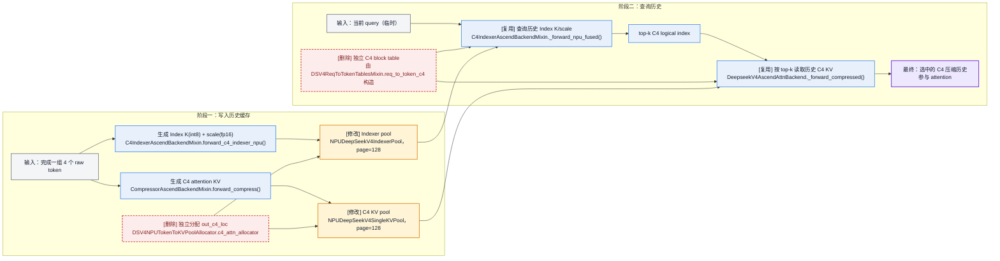

重构后，两个阶段继续共享 C4 地址，但地址来源改为 2.1 的 full 映射：

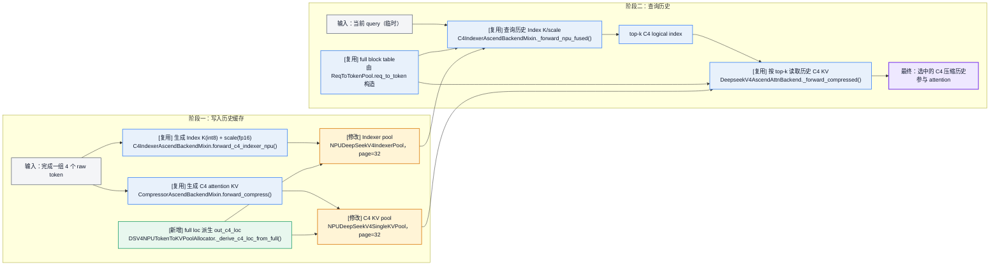

查询历史时复用 full 的具体方式是：backend 将 full block table 作为 `npu_quant_lightning_indexer` 的 `block_table` 参数，但算子读取的是独立 Indexer pool。假设 request 有 300 个 raw token，full block table=`[5,9,2]`，则共有 `300//4=75` 个历史 C4 Index 条目。查询 C4 logical index 35 时，算子计算 logical page=`35//32=1`、offset=`35%32=3`，从 full block table 得到 physical page id 9，最终读取 Indexer pool 的 slot `9*32+3=291` 中的 Index K/scale。所有有效历史条目完成打分后，算子返回 top-k logical index；SparseAttn 再用同一 block table 到 C4 KV pool 读取这些 index 对应的 C4 KV。整个过程不读取 full KV buffer，复用的只是 full block table 中的 physical page id。

有效 Index 数量不由 block table 长度决定，因为 block table 可能包含 padding；它只负责 logical page→physical page 映射。每个 request 的有效 C4 Index 数量由实际序列长度计算：`num_c4=seq_len//4`。NPU fused 路径向 `npu_quant_lightning_indexer` 传入 `actual_seq_lengths_key` 和 `cmp_ratio=4`，算子据此限制打分范围；fallback 路径也直接使用 `seq_i//ratio`。prefill 中每个 query 还会叠加 causal 边界，只能看到该 query 位置之前已经完成的 C4 分组。

只修改 [`_make_indexer_pool()`](dsv4_memory_pool.py#L369-L393) 的 kernel page size，并在初始化时校验它与 C4 page size 一致；[`NPUDeepSeekV4IndexerPool`](dsv4_memory_pool.py#L195-L270) 及其读写方法、[`forward_c4_indexer_npu()`](../attention/ascend_dsv4_backend.py#L841-L950) 均复用。不删除 Indexer pool，也不新增 allocator、request table 或转换方法。

> 当前代码索引：[NPU Indexer pool](dsv4_memory_pool.py#L195-L272) · [GPU 中独立的 C4/Indexer pool](../../../mem_cache/deepseek_v4_memory_pool.py#L612-L645) · [NPU Indexer top-k](../attention/ascend_dsv4_backend.py#L841-L950) · [`npu_quant_lightning_indexer`](../attention/ascend_dsv4_backend.py#L988-L1021) · [top-k 传入 SparseAttn](../attention/ascend_dsv4_backend.py#L1738-L1756)

### 2.3 SWA request table 复用 full→SWA 映射

SWA 和 full 是两个独立分配和回收的地址空间，因此 SWA allocator 必须保留。但通用 allocator 已经维护 `full_to_swa_index_mapping`，GPU 和 NPU 通用 attention 路径都会通过它将 full loc 翻译为 SWA loc。

因此 NPU DSV4 不再需要将相同结果按 request/context 复制到 `req_to_token_swa`：

```text
base req_to_token → full loc → full_to_swa_index_mapping → SWA loc
```

目标修改：

- 保留 SWA allocator 和 `full_to_swa_index_mapping`。
- 删除 `req_to_token_swa` 及其写入逻辑。
- 通用 SWA attention 继续使用现有 full→SWA 映射，不改变计算逻辑。
- 原来读取 `req_to_token_swa` 的 DSV4 消费路径改为：从 base `req_to_token` 取出所需 full loc，再调用现有 `translate_loc_from_full_to_swa()` 翻译。
- SWA 页淘汰时由 allocator 同步清理映射，保证已释放页不再可达。

代码框架对比：

这项修改只调整 SWA 历史地址的保存和读取方式：本轮 `out_swa_loc` 的生成、SWA KV 写入、SWA allocator 和 mapping 均保持不变。重构前后统一以“DSV4 consumer 需要定位某个 request 的历史 SWA 地址”为入口，以“得到历史 SWA loc / page table”为结果。

颜色说明：蓝色表示复用，绿色表示新增，橙色表示修改，红色表示删除；灰色是业务输入，紫色是最终结果。

重构前，DSV4 consumer 直接从独立 request table 读取历史 SWA 地址：

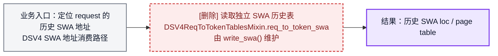

重构后保持相同业务入口和结果，只将地址来源替换为 base `req_to_token` 和现有 mapping：

```mermaid
flowchart LR
    Entry["业务入口：定位 request 的历史 SWA 地址<br/>DSV4 SWA 地址消费路径"]:::neutral
    HistoryFull["[修改] consumer 改读完整 full loc 历史<br/>ReqToTokenPool.req_to_token"]:::changed
    Translate["[复用] 现有地址翻译接口<br/>translate_loc_from_full_to_swa()"]:::reused
    Mapping["[复用] 接口内部查询地址关系<br/>full_to_swa_index_mapping"]:::reused
    Result["结果：历史 SWA loc / page table"]:::result

    Entry --> HistoryFull --> Translate --> Mapping --> Result

    classDef reused fill:#E8F1FB,stroke:#3B82F6,color:#0F172A,stroke-width:1.5px;
    classDef changed fill:#FFF4D6,stroke:#D97706,color:#0F172A,stroke-width:1.5px;
    classDef neutral fill:#F4F5F7,stroke:#6B7280,color:#0F172A,stroke-width:1.5px;
    classDef result fill:#EEE8FF,stroke:#7C3AED,color:#0F172A,stroke-width:2px;
```

`translate_loc_from_full_to_swa()` 本身不修改：它已经支持输入任意形状的 full slot tensor，并返回相同形状的 SWA slot tensor。需要修改的是 DSV4 consumer：先按 request 和有效长度从 base `req_to_token` 截取 full loc，再调用该接口；如果算子需要 page table，则由 consumer 从 SWA slot 换算 SWA page id。

[`DSV4ReqToTokenTablesMixin._init_dsv4_tables()`](dsv4_req_to_token_pool.py#L53-L86) 删除 SWA 表，[`_write_dsv4_tables()`](dsv4_common_hooks.py#L242-L297) 删除对应写入逻辑；原有 SWA 地址消费路径复用 [`SWATokenToKVPoolAllocator.translate_loc_from_full_to_swa()`](../../../mem_cache/allocator/swa.py#L147-L150) 或 KV pool 上的同名接口。这里不新增类、allocator、映射表或翻译方法。

> 当前代码索引：[full→SWA 映射创建与注册](../../../mem_cache/allocator/swa.py#L78-L101) · [alloc 更新映射](../../../mem_cache/allocator/swa.py#L274-L315) · [SWA 回收清理映射](../../../mem_cache/allocator/swa.py#L333-L359) · [GPU DSV4 使用映射](../../../layers/attention/deepseek_v4_backend.py#L1124-L1126) · [NPU 通用路径构造 SWA block table](../attention/ascend_backend.py#L438-L462)

## 3. 改动二：Compressor state 全量切换为 request-scoped ring

改动二的最终目标不是同时维护 paged/ring 两条路径，而是用 Atlas A3 `cache_mode=2` 的 Compressor 完整替代当前 `cache_mode=1`：三类 state 都使用固定 request bank，不再进入 token/page allocator。

### 3.1 统一地址模型

C4 Attention、C4 Indexer 和 C128 使用三类形状不同的 per-layer state pool；每个相关 layer 都有自己的 pool 对象，但地址规则完全一致：

```text
bank_id     = req_pool_idx
ring_offset = absolute_position % ring_size
flat_loc    = bank_id * ring_size + ring_offset
```

SGLang 只向算子传 `state_block_table[b] = req_pool_idx[b]`；`ring_offset` 由算子根据 `start_pos` 和本轮 token offset 计算。当前 request pool 已保留 slot 0 作为 graph padding/dummy，活动请求使用 slot 1..N，因此 bank 0 可直接作为 dummy bank。

| State | 物理 pool | `state_cache` shape | bank | ring offset |
| --- | --- | --- | --- | --- |
| C4 Attention | C4A ring pool | `[req_slots, ring4, 2048]` | `req_pool_idx` | `position % ring4` |
| C4 Indexer | C4Li ring pool | `[req_slots, ring4, 512]` | `req_pool_idx` | `position % ring4` |
| C128 Attention | C128A ring pool | `[req_slots, ring128, 1024]` | `req_pool_idx` | `position % ring128` |

C4 Attention 与 C4 Indexer 的 bank/offset 数值相同，但二者保存的数据和 last dim 不同，必须保留两个独立 tensor。三类 state 均不再依赖 SWA physical page，也不复用 GPU C4 的 SWA→state 地址转换。

颜色说明：蓝色表示复用，绿色表示新增，橙色表示修改，红色表示删除；灰色是业务输入，紫色是最终结果。

重构前，state 地址沿着“分配→写 loc→写 request table→构造 page table”的链路流动：

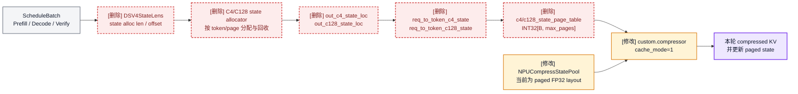

重构后，request slot 本身就是 state bank，不再存在 state 地址分配链：

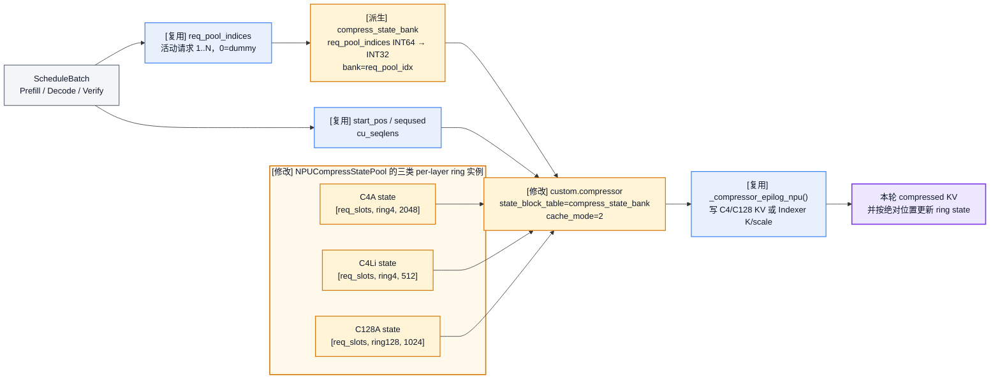

### 3.2 四个可独立 review 的子改动

四个子改动按 storage ownership、Eager、Graph/MTP、PD 四个责任边界拆分。每个子改动同时加入 ring 逻辑并删除被它替代的 paged 逻辑；不再设置“删除 allocator”和“删除 table”两个独立清理阶段。前三项合起来完成单机切换，第四项完成跨实例传输。

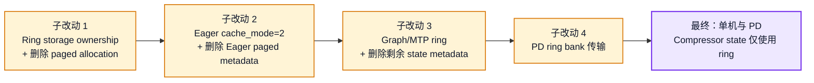

#### 3.2.1 子改动 1：Ring storage ownership 与 paged allocation 删除

- 在 `dsv4_memory_pool.py` 原地重构现有 `NPUCompressStatePool`。保留类名、现有 factory、layer mapping 以及 `get_state_cache()` 调用边界，只把内部 storage 改为 `[req_slots, ring_size, 2 * coff * head_dim]` 连续 FP32 layout。
- 沿用现有 `compress_state_pools` 与 `indexer_compress_state_pools` 的 per-layer 实例和 layer mapping；C4A、C4Li、C128A 是三种实例类型而非全模型三个对象，只改变各实例内部 layout。`req_slots` 使用实际 request table 行数，覆盖普通模式和 decode 预分配 slot。
- 不新增第二个 `RingCompressorStatePool`/`NPURingCompressStatePool` 类型，避免 factory、访问接口和生命周期形成双轨抽象。
- 新 request 第一次取得 `req_pool_idx` 时清对应 bank：KV 置 0、score 置 `-inf`；chunked prefill、decode 和 verify 复用同一 request slot 时不清。
- 同步删除 `npu_state_pool_size()`、paged page view、page-0 sentinel 和 KV cache configurator 中的 paged-state sizing override。
- 同步删除 `c4_state_attn_allocator/c128_state_attn_allocator`、`DSV4StateLens`、`out_c4_state_loc/out_c128_state_loc` 及其 alloc/free/clear/evict 分支；`DSV4OutCacheLoc` 只承载 KV 地址。
- 增加 shape/dtype/contiguous、单 bank 清理、slot 复用、dummy bank，以及 allocator/bundle 不再包含 state 的单测。本子改动只负责 storage ownership；Compressor consumer 的 Eager 和 Graph 切换分别属于子改动 2、3。

本子改动的输入是实际 request slot 容量和三种 Compressor shape，结果是 state ownership 从 token/page allocator 一次性迁移到 request bank；旧 state allocator、lens、loc 和 paged sizing 在同一个子改动中删除。

重构前，pool 大小和物理页由 paged state allocator 模型决定：

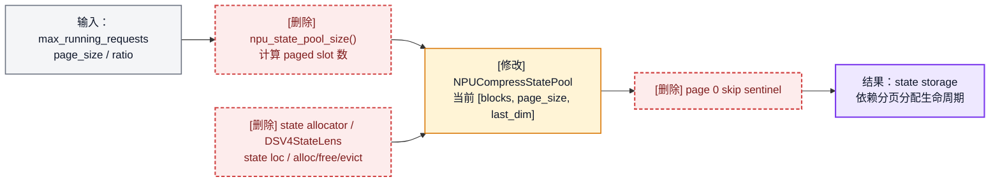

重构后，request slot 容量直接决定 bank 数，三类 per-layer pool 实例共享同一个 bank 编号规则；allocator bundle 只保留 KV 地址：

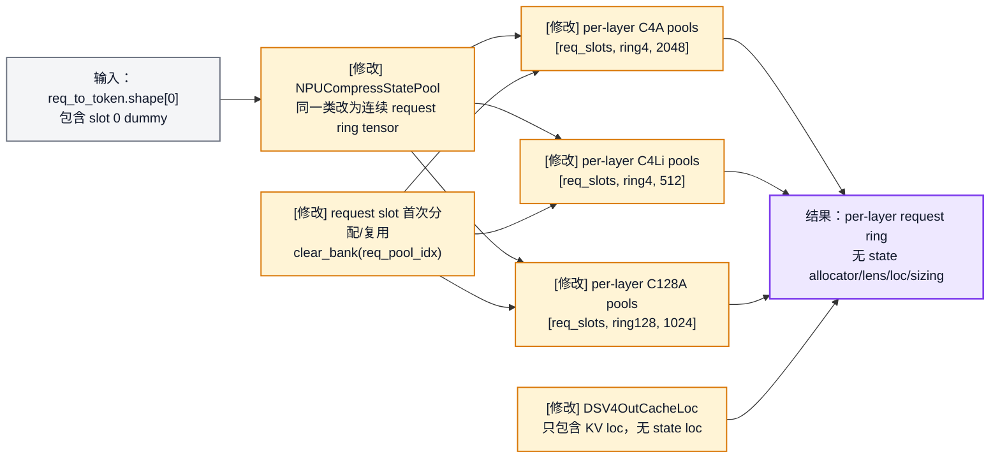

#### 3.2.2 子改动 2：Eager ring 切换与 Eager paged metadata 删除

- `forward_compress()` 固定传 `cache_mode=2`；复用已有 `get_state_cache(layer_id, is_in_indexer)` 路由取得当前层的 C4A、C4Li 或 C128A pool，不新增选择函数。
- 在每个 Eager batch 构造 metadata 时，只派生一次 `compress_state_bank = req_pool_indices.to(torch.int32)`，供所有 Compressor 层作为 `state_block_table` 复用。它不是函数、长期 table 或新 ownership。
- 同步删除 Eager 路径的 state loc 写表 hook、`c4_state_page_table/c128_state_page_table` 构造与消费；prefill 显式设置 `seqused=cu_seqlens[1:]-cu_seqlens[:-1]`。
- 保留 RoPE、Hadamard、输出长度检查和 `_compressor_epilog_npu()`，避免把 state 重构扩散到 compressed KV 写入链路。
- 覆盖 C4A/C4Li/C128A 的 eager prefill、decode、空 batch、非恒等 bank 映射，以及每个 batch 只做一次 INT64→INT32 bank 转换。

本子改动的输入是 Eager batch 的 request/sequence metadata 和子改动 1 改造后的 ring pool，结果是 Eager 计算统一切到 `cache_mode=2`，同时不再产生、写入或消费任何 Eager paged-state metadata。

重构前，backend 从两张 state request table 构造二维 page table：

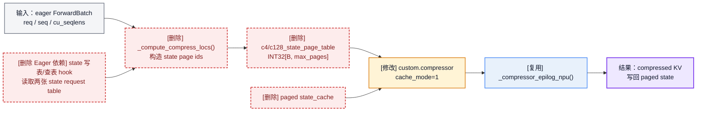

重构后，只构造一维 request bank；同一个 bank tensor 配合不同 state pool 分别完成 C4A、C4Li、C128A 调用：

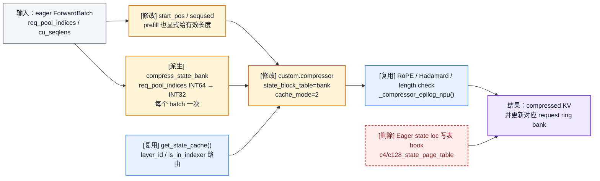

#### 3.2.3 子改动 3：Graph/MTP ring 切换与剩余 paged metadata 删除

- Graph capture 时分配固定地址的 `compress_state_bank`，replay 只原地 `copy_`；idle/padding 行统一写 bank 0，并同步清 `start_pos/seqused`。
- target verify 使用 `start_pos=committed prefix length`、`seqused=draft token count`，同一 request 在 verify 和后续 decode 期间保持 bank 不变。
- ring size 按最大单次 request token 宽度计算，至少覆盖最大 verify draft 宽度；rejected suffix 不做 state allocator rollback，下一轮从 committed 位置覆盖。
- 同步删除 Graph 中固定的 `c4/c128_state_page_table`、`c4/c128_state_loc` 及其 refresh/copy 逻辑，并删除 MTP speculative state reserve/rollback/clear 分支。
- Eager 与 Graph consumer 都移除后，同步删除 `req_to_token_c4_state/req_to_token_c128_state`、`write_c4_state()/write_c128_state()` 及剩余 state write/free hooks；这些删除不再单列子改动。
- 覆盖 graph 两次动态 replay、真实/idle 混合 batch、不同 bank、accepted=0/1/中间值/全部接受，并断言单机代码中不存在 state request table/page table/loc consumer。

本子改动有两路输入：graph replay 的固定 tensor 约束，以及 MTP 的 committed/accepted 长度；结果是 Graph/MTP 与 Eager 使用完全相同的 ring 地址语义，同时删除单机路径最后的 state request table、page table、loc 和 speculative allocator hook。

重构前，graph 固定持有二维 page table/state loc，MTP 继续预留和回收 speculative state slot：

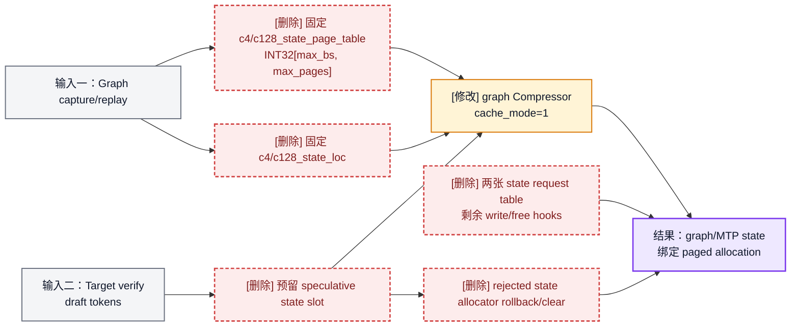

重构后，graph 只固定一维 bank tensor；MTP 通过绝对起点和 accepted 长度表达提交/覆盖：

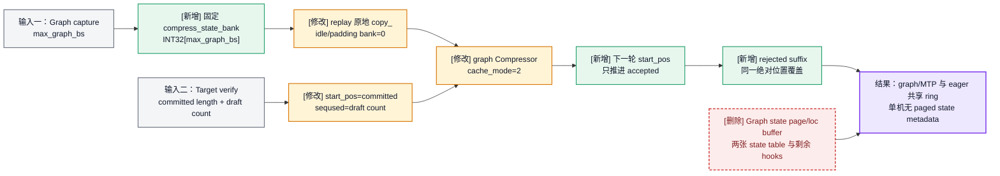

#### 3.2.4 子改动 4：PD 分离切换为 ring bank 传输

- `DSV4_C4_STATE` 和 `DSV4_C128_STATE` 继续作为两个 state component；C4 component 内包含 C4A 与 C4Li 多个 buffer，二者复用同一 bank index。
- `get_pd_state_components()` 将 state `item_len` 从“一页 paged state”改成“一个完整 ring bank”；Prefill source 和 Decode destination 分别使用本地 `req_pool_idx` 计算 bank。
- `dsv4_state_payloads()` 不再读取两张已删除的 state table，而是分别返回 source bank 和 destination bank；两侧 bank id 可以不同，但数量和顺序必须一一对应。
- Ascend connector 对 SWA/C4/C128/Indexer KV 继续执行原有 exact index 约束；对两个 ring state component 改为允许 source/destination bank remap。
- Prefill/Decode 必须使用相同的 C4/C128 ring size；接收前清 destination bank，传输后用 committed sequence length 继续计算，不需要恢复 state request table 或 cursor。
- 覆盖 source bank≠destination bank、C4A/C4Li/C128A 全量 state 对比、传输后继续 decode、bank 释放复用及 PD+MTP。

本子改动的输入是 Prefill/Decode 两侧已经一致的 ring layout，以及各自本地 request slot；结果是跨实例搬运完整 bank，而不是传输 state page list。

重构前，PD state payload 仍依赖 paged request table，并要求源/目标 page index 精确相同：

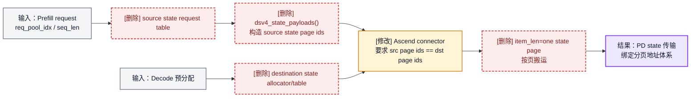

重构后，源/目标各自计算本地 bank，connector 按 component 将一个完整 source bank 搬到对应 destination bank：

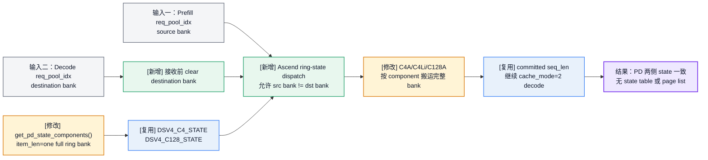

| 子改动 | 主要文件 | 行为切换 | 独立验收点 |
| --- | --- | --- | --- |
| 1. Ring storage ownership | `dsv4_memory_pool.py`、`dsv4_allocator.py`、`forward_batch_info.py`、`kv_cache_configurator.py` | 原地 ring 化；同步删除 paged sizing、state allocator/lens/loc | per-layer 三类 pool、清 bank、KV-only bundle、无 state alloc/free |
| 2. Eager ring | `ascend_dsv4_backend.py`、Eager hooks | Eager 切 `cache_mode=2`；同步删除 Eager state 写表/page-table 链 | 三变体、bank 每 batch 仅派生一次、无 Eager paged metadata |
| 3. Graph/MTP ring | `ascend_dsv4_backend.py`、`dsv4_req_to_token_pool.py`、`dsv4_common_hooks.py`、spec runtime | Graph/MTP 切 ring；同步删除剩余 state table/hooks/rollback | replay metadata、rejected overwrite、单机无 paged state metadata |
| 4. PD ring | `dsv4_memory_pool.py`、`dsv4_common_hooks.py`、`disaggregation/ascend/conn.py` | 切换跨实例 state 传输 | source/destination bank 可重映射，传输后三类 state 一致 |

> 当前代码索引：[NPU paged state pool](dsv4_memory_pool.py#L84-L192) · [state allocator 和 state length](dsv4_allocator.py#L221-L575) · [state table 写入与回收](dsv4_common_hooks.py#L242-L373) · [graph metadata](../attention/ascend_dsv4_backend.py#L1082-L1408) · [fused compressor 调用](../attention/ascend_dsv4_backend.py#L370-L430)

## 4. MTP 相关适配

MTP 的 draft、target verify 和 accepted/rejected 处理会同时使用 KV 写地址与 compressor state，因此两项改动都需要适配，但不改变 MTP 的生成、校验和 Indexer top-k 算法。

这里的 `bundle` 指 [`DSV4OutCacheLoc`](../../../model_executor/forward_batch_info.py#L261-L288)：它不是缓存或映射表，只是一次 forward 使用的 DSV4 写地址集合。改动一后，full loc 成为 SWA/C4 地址的唯一来源；改动二后，state 地址不再放入 bundle。

```text
预留 draft full loc
    → 按 MTP step 取得本步 full loc
    → 翻译 SWA loc / 派生 C4 loc
    → 写入本步 KV 和 ring state
    → target verify 使用相同地址规则
    → accepted/rejected 后提交 KV 长度和 ring state
```

| MTP 环节 | 当前方式 | 完成改动一后 | 完成改动二后 |
| --- | --- | --- | --- |
| DSV4 allocator 识别 | [`allocation.py`](../../../mem_cache/allocation.py#L198-L244) 通过 `hasattr(c4_attn_allocator)` 识别 DSV4 | 改为显式 DSV4 capability/type 标识，删除 C4 allocator 后仍能返回 DSV4 地址 bundle | 标识保留，bundle 不再包含 state loc |
| Draft 地址预留 | [`alloc_paged_token_slots_reserve_extend()`](dsv4_allocator.py#L68-L118) 预留 full/SWA/C4/C128/state 并写各自 request table | 预留 full/SWA/C128 和 paged state；SWA/C4 不再写独立 request table，C4 loc 由 full loc 派生 | 只预留 full/SWA/C128 KV；ring state 使用固定空间，不参与 token allocator 预留 |
| 多步地址获取 | [`_step_out_cache_loc_dsv4()`](../attention/ascend_dsv4_backend.py#L2007-L2074) 从预分配的 `out_swa_loc/out_c4_loc` 按 step 切片 | 每一步先切出本步 full loc，再翻译 SWA loc，并按 4-token 边界派生 C4 loc | KV 地址规则不变；state 由 request、position 和 ring bank 直接定位，不再切 state loc |
| Target verify | [`maybe_build_dsv4_verify_bundle()`](dsv4_common_hooks.py#L376-L410) 从 SWA/C4/state request table 截取 draft 区间 | 使用 verify 阶段已有的 full loc 重新翻译 SWA loc、派生 C4 loc；C128/state 暂时保留原表 | KV 继续使用改动一规则；state 传 `bank=req_pool_idx`、`start_pos=committed length`、`seqused=draft count` |
| MTP metadata | 每个 step/replay 维护独立 C4 page table 以及 C4/SWA/state loc buffer | C4 page table 复用 full block table，C4/SWA loc 由本步 full loc 生成 | 删除 state loc/page table，只保留共享 request bank、绝对起点和本轮有效长度 |
| Accepted/rejected | allocator snapshot 回滚 full、SWA、C4、C128 和 state | 删除 C4 allocator 快照；被拒绝的 C4/Indexer 数据由有效序列长度隔离，后续按同一 full page id 覆盖 | state 不做 allocator rollback；下一轮只从 `old_start_pos + accepted` 继续，被拒绝 suffix 在相同绝对位置覆盖 |

MTP 的正确性依赖绝对位置而不是 ring 写指针回退：runtime 只推进 accepted token 数，算子按 `absolute_position % ring_size` 读写。ring size 必须包含最大 verify 宽度的 guard 空间，避免同一轮 draft 覆盖本轮仍需读取的 committed state；满足该容量约束后，被拒绝 suffix 无需显式清理或搬移。

改动一还需要保证：draft 地址预留、逐 step draft 和 target verify 使用相同的 request 顺序与 4-token 边界规则，使派生的 C4 loc 始终与 compressor 输出顺序一致。

> 当前代码索引：[MTP 预留空间](../../../speculative/eagle_utils.py#L803-L872) · [多步 full 地址切片](../../../speculative/eagle_utils.py#L58-L80) · [NPU DSV4 多步 bundle](../attention/ascend_dsv4_backend.py#L1984-L2074) · [target verify 地址](../../../speculative/eagle_utils.py#L490-L528) · [allocator 回滚](dsv4_allocator.py#L779-L810)

## 5. PD 分离相关适配

PD 按两项改动分别收敛：改动一让 SWA/C4/Indexer 的 page id 回到 full 地址来源；改动二的子改动 4 再把 Compressor state 从“paged state page list”切成“source request bank → destination request bank”的完整 bank 传输。两部分都不改变 KV 与 state 物理 buffer 彼此独立的事实。

### 5.1 改动一后的 PD 删除边界

结论是：**需要删除的是 PD 中跟随旧地址所有权的分配、写表和读表分支，不是 C4、Indexer 或 SWA 的数据传输分支。** C4 KV、Indexer K/scale 和 SWA KV 的物理 buffer 仍然存在，因此对应的 `AscendStateType`、buffer 注册和传输请求都必须保留。

这里先统一数量口径：按本方案第 2 节的定义，改动一删除的是 **1 个 C4 allocator 和 2 张辅助 request table**（`req_to_token_c4`、`req_to_token_swa`）。Indexer 一直保留独立 pool，但与 C4 共用 `out_c4_loc`，没有第二个独立 Indexer allocator。如果把 C4 KV 和 Indexer 两个 pool 都称为“两个地址消费者”，它们确实同时失去独立地址所有权，但 runtime 中实际删除的 allocator 只有 C4 allocator。

PD 代码按以下边界处理：

| 代码/职责 | 改动一后的处理 | 原因 |
| --- | --- | --- |
| C4 allocator 的 PD 预留、free、clear/rollback 分支 | 删除 | C4 loc/page id 由 full 地址派生，不再拥有独立生命周期 |
| `write_swa()`、`write_c4()` 及 `_write_dsv4_tables()` 中对应写表分支 | 删除 | `req_to_token_swa`、`req_to_token_c4` 已删除，继续写入会形成第二份地址真相 |
| `dsv4_state_payloads()` 中读取两张旧表的分支 | 替换 | SWA 改为 base `req_to_token` + full→SWA mapping；C4/Indexer 改为 base `req_to_token` 的 full page id |
| C4 和 Indexer page-list 构造 | 合并为同一个 full-page builder/缓存结果 | 两者使用相同 page id；仍以两个 StateType 传输不同 buffer |
| `dsv4_prealloc_kwargs()`、`dsv4_unwrap_prealloc()`、`write_dsv4_prealloc_tables()` | 保留，但只服务 C128 和 paged state | 改动一后 C128 allocator 和两类 state allocator/table 仍存在；删除整个 wrapper 会导致 decode 侧没有目标页 |
| `get_pd_state_components()` 中 SWA/C4/Indexer/C128/state buffer 注册 | 保留 | 地址收敛不等于数据 buffer 合并；C4 与 Indexer 仍需分别传输 |
| `AscendStateType`、`_DSV4_KVCACHE_STATE_TYPES` 和 Ascend generic page dispatch | 保留 | connector 的 StateType 标识物理 buffer component，不标识 allocator/request table |
| `req_to_token_c128` 和两张 state table 的 page-list 构造 | 保留 | 它们要到改动二或后续方案才发生变化 |

当前实现已经完成了表格中的主要删除和替换；进一步适合做的是把 C4/Indexer 两次相同的 full page D2H 构造收敛成一次，并把 `hasattr(c128_attn_allocator)` 这类临时识别改成显式 DSV4 capability，避免能力判断继续绑定某个未来可能变化的子 allocator。

改动一前，PD 预分配和 payload 都跟随各自的独立地址表：

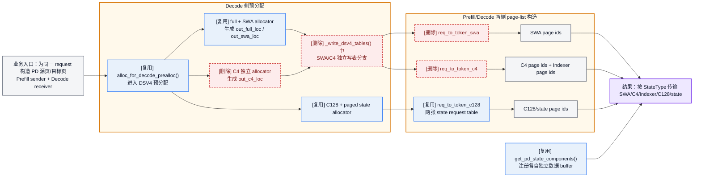

改动一后，PD 保留相同传输框架，但 page id 收敛为三种来源：full、full→SWA mapping、剩余 C128/state table。

```mermaid
flowchart LR
    Entry["业务入口：为同一 request 构造 PD 源页/目标页<br/>Prefill sender + Decode receiver"]:::neutral

    subgraph PreallocAfter["Decode 侧预分配"]
        direction TB
        Prealloc["[复用] alloc_for_decode_prealloc()<br/>进入 DSV4 预分配"]:::reused
        ParentAlloc["[复用] full + SWA allocator<br/>SWA allocator 仍保留"]:::reused
        OtherAlloc["[复用] C128 + paged state allocator"]:::reused
        BaseTable["[复用] 通用路径维护 base req_to_token<br/>只记录 full loc"]:::reused
        RemainingWrite["[修改] dsv4_unwrap_prealloc()<br/>只写 C128/state table"]:::changed
        Removed["[删除] C4 allocator<br/>SWA/C4 独立写表分支"]:::deleted

        Prealloc --> ParentAlloc --> BaseTable
        Prealloc --> OtherAlloc --> RemainingWrite
        Prealloc --> Removed
    end

    subgraph PayloadAfter["Prefill/Decode 两侧 page-list 构造"]
        direction TB
        FullPages["[新增] 一次构造 full physical page ids<br/>来自 base req_to_token"]:::added
        C4Pages["[复用] C4 page ids"]:::reused
        IndexPages["[复用] Indexer page ids<br/>与 C4 使用同一组 id"]:::reused
        Translate["[复用] translate_loc_from_full_to_swa()<br/>查询 full_to_swa_index_mapping"]:::reused
        SWAPages["SWA page ids"]:::neutral
        OtherTables["[复用] req_to_token_c128<br/>两张 state request table"]:::reused
        OtherPages["C128/state page ids"]:::neutral

        BaseTable --> FullPages
        FullPages --> C4Pages
        FullPages --> IndexPages
        BaseTable --> Translate --> SWAPages
        RemainingWrite --> OtherTables --> OtherPages
    end

    Buffers["[复用] get_pd_state_components()<br/>C4/Indexer 仍注册不同 buffer"]:::reused
    StateTypes["[复用] AscendStateType<br/>每个 StateType 对应一组 ptr/item_len/index"]:::reused
    Dispatch["[复用] AscendKVManager generic page dispatch<br/>并校验源/目标 index 数量一致"]:::reused
    Transfer["结果：page id 可共享，数据 buffer 仍按 StateType 分别传输"]:::result

    Entry --> Prealloc
    C4Pages --> StateTypes
    IndexPages --> StateTypes
    SWAPages --> StateTypes
    OtherPages --> StateTypes
    Buffers --> StateTypes --> Dispatch --> Transfer

    classDef reused fill:#E8F1FB,stroke:#3B82F6,color:#0F172A,stroke-width:1.5px;
    classDef added fill:#E8F7EE,stroke:#22A06B,color:#0F172A,stroke-width:1.5px;
    classDef changed fill:#FFF4D6,stroke:#D97706,color:#0F172A,stroke-width:1.5px;
    classDef deleted fill:#FDECEC,stroke:#D14343,color:#7F1D1D,stroke-width:2px,stroke-dasharray:5 3;
    classDef neutral fill:#F4F5F7,stroke:#6B7280,color:#0F172A,stroke-width:1.5px;
    classDef result fill:#EEE8FF,stroke:#7C3AED,color:#0F172A,stroke-width:2px;
    style PreallocAfter fill:#FFF9EB,stroke:#D97706,color:#0F172A,stroke-width:2px;
    style PayloadAfter fill:#FFF9EB,stroke:#D97706,color:#0F172A,stroke-width:2px;
```

### 5.2 Ascend connector 的保留与后续收敛

`disaggregation/ascend/conn.py` 中没有直接读取 allocator 或 request table；它消费的是上游已经构造好的 `state_indices`，再把每个 StateType 对应的 buffer 指针、`item_len` 和源/目标 index 交给通用 page-indexed 传输。因此，改动一**没有可以直接删除的 connector 分支**：

| Ascend connector 对象 | 改动一后的处理 | 说明 |
| --- | --- | --- |
| `AscendStateType.DSV4_SWA` | 保留 | SWA buffer 仍独立，page id 经 full→SWA mapping 得到 |
| `AscendStateType.DSV4_C4` | 保留 | 标识 C4 KV buffer component；不代表 C4 allocator |
| `AscendStateType.DSV4_INDEXER` | 保留 | 与 C4 共用 index，但指向独立 Index K/scale buffers 和不同 `item_len` |
| `AscendStateType.DSV4_C128` | 保留 | C128 buffer 和独立地址体系不变 |
| `DSV4_C4_STATE` / `DSV4_C128_STATE` | 改动一保留 | 改动二保留 component 名称，但 `item_len/index` 语义切换为完整 ring bank |
| `_is_generic_kvcache_state_type()` 扩展 | 保留 | 六类 component 当前都走 `_send_kvcache_generic()` page-indexed 传输 |
| `_requires_exact_state_index_match()` 扩展 | 保留 | Prefill/Decode page list 必须位置对齐，不能静默截断 |
| `register_buffer_to_engine()` 的 state component 注册 | 保留 | allocator 删除不释放或合并物理数据 buffer |

可以做的 connector 收敛有两项，但都不是改动一的必需删除：

1. 将 `_DSV4_KVCACHE_STATE_TYPES` 拆成 KV component 组（SWA/C4/C128/Indexer）和 ring-state component 组（C4/C128 state）：前者继续要求源/目标 page index 精确匹配，后者允许 source/destination request bank 重映射。
2. 如果希望连 metadata 也去重，可以增加 `DSV4_INDEXER → DSV4_C4` 的 index alias，让 connector 只序列化一次共享 page list，再分别配对两个 component 的 buffer 指针。当前 `state_indices` 与 `state_types` 是位置并行数组，直接删除 `DSV4_INDEXER` 或它的 index entry 会导致后续 component 全部错位，因此必须先扩展协议，不能在 `conn.py` 内单点删除。

所以改动一的推荐范围是：先在 `dsv4_state_payloads()` 内复用同一次 C4/Indexer page-list 构造，保持 connector 协议和六个 StateType 不变；metadata alias 作为独立优化，不阻塞地址空间重构。

### 5.3 改动二后的 PD ring payload

| 数据 | 完成改动一后 | 完成改动二后 |
| --- | --- | --- |
| SWA KV | base `req_to_token` → full→SWA mapping → SWA page ids | 不变 |
| C4 KV | full page ids，C4 page size 32 | 不变 |
| Indexer K/scale | 与 C4 共用 page ids，传输独立 buffer | 不变 |
| C128 KV | `req_to_token_c128` → C128 page ids | 不变 |
| C4A/C4Li state | 两张 buffer 复用 `req_to_token_c4_state` 的 paged page list | 两张 buffer 复用 `[source_req_pool_idx] → [destination_req_pool_idx]` bank 映射 |
| C128A state | `req_to_token_c128_state` 的 paged page list | `[source_req_pool_idx] → [destination_req_pool_idx]` bank 映射 |

`get_pd_state_components()` 对 ring state 的每个物理 tensor 仍注册独立指针，但 `item_len` 改为一个完整 bank 的字节数。`DSV4_C4_STATE` component 可以包含同层序排列的 C4A/C4Li buffer，它们使用相同的一项 bank index；`DSV4_C128_STATE` 包含 C128A buffer。

Prefill 与 Decode 的 `req_pool_idx` 不要求相同。发送侧构造 source bank list，接收侧构造 destination bank list，Ascend connector 只要求二者元素数量和顺序一致，然后逐项完成 bank remap。KV component 仍保留 exact index match，不能因为 state 支持重映射而放松 KV page 校验。

由于 ring slot 由绝对位置取模确定，只要 Prefill/Decode 使用相同 ring size，复制完整 bank 后即可凭 committed sequence length 继续 decode，不需要额外 cursor。接收侧在传输前清目标 bank，防止没有被有效 state 覆盖的字节保留上一个 request 的内容。

> 当前代码索引：[DSV4 PD payload](dsv4_common_hooks.py#L84-L197) · [PD 预分配适配](dsv4_common_hooks.py#L200-L290) · [PD buffer 注册](../../../disaggregation/utils.py#L960-L1001) · [Ascend StateType 与分发](../../../disaggregation/ascend/conn.py#L23-L43) · [exact-index 校验](../../../disaggregation/ascend/conn.py#L38-L43)

## 6. 分步目标结构

重构分两步：先完成 full 地址映射收敛，再将 compressor state 切换为 ring。C4 KV、Indexer 和 state 的物理 buffer 始终保留，收敛的是地址分配和 request table。

### 6.1 完成改动一后

| 对象 | 重构前 | 完成改动一后 |
| --- | --- | --- |
| SWA KV | 独立 allocator + `req_to_token_swa` | 保留 allocator，地址由 full→SWA 映射生成 |
| C4 KV | page=128 + 独立 allocator/table | 独立 buffer，page=32，复用 full page id |
| C4 Indexer | 独立 pool，page=128 | 独立 pool，page=32，与 C4 共享 full 地址 |
| C128 KV | 独立 allocator/table | 不变 |
| Compressor state | paged allocator/table | 不变，留到改动二 |

这一步完成后：

- allocator：6 个 → 5 个，删除 C4 allocator。
- DSV4 辅助 request table：5 张 → 3 张，保留 `req_to_token_c128`、`req_to_token_c4_state` 和 `req_to_token_c128_state`。

### 6.2 完成改动二后（最终）

改动二在改动一的结构上，将 compressor state 从 paged 管理改为 ring。

| 对象 | 重构前 | 完成改动二后（最终） |
| --- | --- | --- |
| full | full allocator + base `req_to_token` | 不变，作为 C4/Indexer 地址基准 |
| SWA KV | 独立 allocator + `req_to_token_swa` | 独立 allocator + full→SWA 映射 |
| C4 KV | page=128 + 独立 allocator/table | 独立 buffer，page=32，复用 full page id |
| C4 Indexer | 独立 pool，page=128 | 独立 pool，page=32，与 C4 共享 full 地址 |
| C128 KV | 独立 allocator + `req_to_token_c128` | 不变 |
| C4 attention/Indexer state | paged allocator + `req_to_token_c4_state` | 两个独立 ring tensor，统一使用 `req_pool_idx` bank |
| C128 state | paged allocator + `req_to_token_c128_state` | 独立 ring tensor，统一使用 `req_pool_idx` bank |
| PD Compressor state | 按 state request table 构造 page list，要求源/目标 page 对齐 | 传输完整 source bank 到 destination bank，允许两侧 `req_pool_idx` 不同 |

这一步完成后：

- allocator：6 个 → 3 个，仅保留 full、SWA 和 C128。
- DSV4 辅助 request table：5 张 → 1 张，仅保留 `req_to_token_c128`。
- 加上通用 base `req_to_token`，最终共保留两张 request→token table。
- 单机和 PD 的 Compressor state 都只使用 request-scoped ring，不再存在 paged state page list。

```text
重构前：6 个 allocator / 5 张辅助 request table
改动一：5 个 allocator / 3 张辅助 request table
改动二：3 个 allocator / 1 张辅助 request table
```

> 改动文件索引：[pool 布局](dsv4_memory_pool.py#L47-L272) · [allocator](dsv4_allocator.py#L122-L188) · [request table](dsv4_req_to_token_pool.py#L43-L101) · [table/state hooks](dsv4_common_hooks.py#L242-L373) · [forward 分配结果](../../../model_executor/forward_batch_info.py#L261-L322) · [attention/compressor metadata](../attention/ascend_dsv4_backend.py#L242-L430)

## 7. 后续任务：DSV4 全组件 Prefix Cache

以下任务在本次 mempool 重构完成后实施，不阻塞当前重构。

### 7.1 单机全组件 Prefix Cache

- Full 继续作为主 Radix Tree；SWA 通过 full→SWA mapping、C4/Indexer 通过 full page id 复用，并与对应 full 节点绑定生命周期。
- C128 使用独立 Radix Tree 保存 C128 page loc；最终命中长度取所有必需组件的共同前缀，并满足各组件 page/compress 对齐约束。
- C4/C128 compressor ring state 不能直接随 token page 复用，需要保存命中边界的 state checkpoint，或从最近 checkpoint 重算；具体方案后续确定。
- 统一处理各组件引用计数、淘汰和回收，覆盖 Full、SWA、C4、Indexer、C128 及 compressor state 的命中正确性和 page/bank 复用测试。

### 7.2 PD 分离适配

- Prefill 端传输 Full、SWA、C4、Indexer、C128 以及必要的 compressor state/checkpoint 和有效前缀元信息；Decode 端按本地地址体系恢复所有组件。
- P/D 不直接复用物理 page/bank loc；Decode 端完成本地分配、地址映射和数据传输后，再原子发布对应 Prefix Cache 条目。
- 任一组件传输失败或请求取消时回滚全部目标资源，覆盖跨实例全组件命中、传输后继续 decode 和淘汰复用测试。
